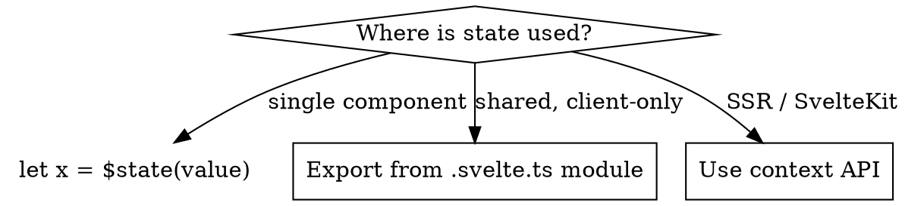

# Svelte 5 State Management

## Decision Flow



## Shared State via .svelte.ts Modules

**Critical rule:** You cannot export a `$state` variable that gets reassigned — importers won't see the reassignment because signal get/set is per-file. Three patterns work:

### Pattern 1: Object Mutation (grouped state)

```ts
// app-state.svelte.ts
export const appState = $state({
  theme: 'light',
  sidebarOpen: false
});
// Components mutate properties: appState.theme = 'dark'
```

### Pattern 2: Getter/Function (primitives)

```ts
// counter.svelte.ts
export function createCounter(initial = 0) {
  let count = $state(initial);
  return {
    get count() { return count; },
    increment() { count += 1; }
  };
}
export const counter = createCounter();
```

### Pattern 3: Reactive Class

```ts
// auth.svelte.ts
class AuthState {
  user = $state<User | null>(null);
  get isLoggedIn() { return this.user !== null; }
  login(user: User) { this.user = user; }
  logout() { this.user = null; }
}
export const auth = new AuthState();
```

## SSR Safety: Context Over Modules

Module-level state is **shared across all server requests** — causes data leakage between users.

Use context API for SSR:

```svelte
<!-- +layout.svelte -->
<script>
  import { setContext } from 'svelte';
  let notifications = $state([]);
  setContext('notifications', notifications);
</script>
```

```svelte
<!-- Any descendant -->
<script>
  import { getContext } from 'svelte';
  const notifications = getContext('notifications');
</script>
```

**Always mutate the context object, never reassign it** — reassignment breaks the reference.

For primitives, pass a getter: `setContext('user', () => data.user)` and call it: `getContext('user')()`.

Since **Svelte 5.40**, `createContext()` returns a type-safe `[get, set]` pair.

## Reactive Collections

`$state` only deep-proxies plain objects and arrays. For built-in collections:

| Need | Use |
|------|-----|
| `Map` | `SvelteMap` from `svelte/reactivity` |
| `Set` | `SvelteSet` from `svelte/reactivity` |
| `Date` | `SvelteDate` from `svelte/reactivity` |
| `URL` | `SvelteURL` from `svelte/reactivity` |

Values inside `SvelteMap`/`SvelteSet` are NOT made deeply reactive — only collection membership is tracked.

## When to Use Stores

`svelte/store` is **not deprecated but no longer primary**. Still useful for:
- Complex async data streams
- RxJS interop
- Custom subscription patterns with start/stop logic

For most new code, runes in `.svelte.ts` files are simpler.
