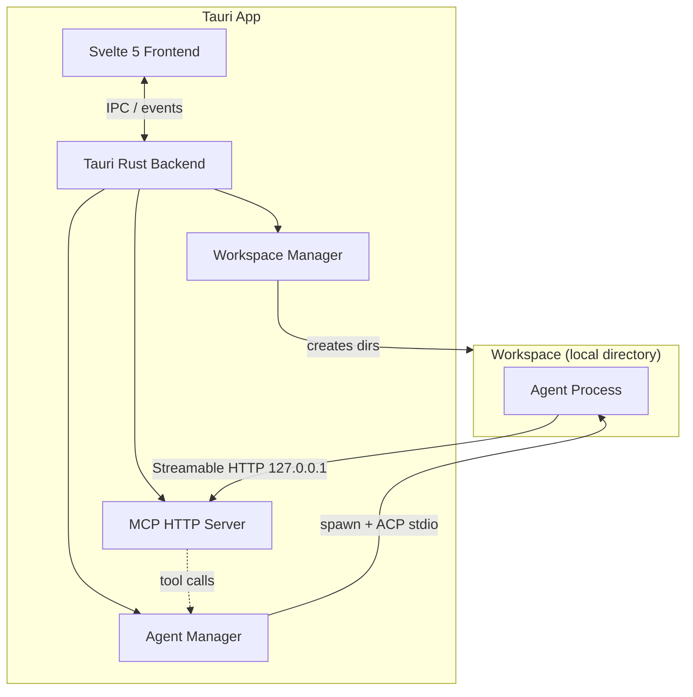

# Emergent

A desktop app for running ACP-compatible LLM agents as local processes in per-agent workspaces. Define agents with optional roles, open multiple conversation threads per agent, and watch several agents work side-by-side from a native desktop UI.


## Features

- **Local Workspaces** — Workspaces live under `~/.emergent/`; every agent runs as a local host process in its own directory (used as the agent's `$HOME`), so per-agent config stays isolated
- **Configured Agents + Threads** — Define agents once, give them optional roles, and create multiple conversation threads per agent
- **Swarm Coordination** — Connect running threads inside a workspace and expose peer-aware MCP tools such as `list_peers` and `send_message`
- **Integrated Terminal** — Open a host terminal session rooted in any workspace
- **Multi-Provider Support** — Works with Claude Code, Gemini CLI, Codex, Kiro, OpenCode, and other ACP-compatible agents
- **Real-Time Streaming Chat** — Watch responses stream live with markdown rendering, thinking blocks, and tool call output
- **Native Desktop App** — Built with Tauri 2 for a fast, lightweight experience on macOS, Windows, and Linux

## Architecture

The Tauri app embeds the orchestration layer directly. There is no separate daemon process: the app owns the `AgentManager`, `WorkspaceManager`, and an embedded MCP HTTP server used by agent threads.



**How it works:**

1. The user creates a **workspace** — a directory under `~/.emergent/` — and adds agents to it, each getting its own subdirectory.
2. The **Svelte frontend** communicates with the **Tauri backend** through IPC commands.
3. The Tauri backend owns the **agent manager** and **workspace manager**. Agents are spawned as **local host processes** — each rooted in `~/.emergent/<workspace>/agents/<agent>/`, used as both its working directory and `$HOME` for config isolation — and communicate over **ACP** (stdio).
4. Each running thread is registered with the app's embedded **MCP HTTP server** on `127.0.0.1:{port}/mcp` and authenticated with a per-thread bearer token.
5. On the first prompt, the app can prepend an invisible **system block** with Emergent-specific instructions such as swarm guidance and the agent's configured role.
6. Agent and workspace notifications flow through the Tauri backend and are emitted to the frontend as live UI updates.
7. Agent definitions, thread mappings, and workspace state are persisted locally so sessions can be restored.

## Tech Stack

- **Frontend:** Svelte 5, TypeScript, Tailwind CSS 4, Vite 7
- **Backend:** Rust, Tauri 2, Tokio, Axum
- **Execution:** Local host processes, isolated by per-agent working directory + `$HOME`
- **Protocol:** [Agent Client Protocol (ACP)](https://github.com/anthropics/agent-client-protocol) for agent communication
- **MCP transport:** Streamable HTTP served by the embedded app
- **Tooling:** Bun, Vitest, Playwright, oxlint, svelte-check, Clippy

## Getting Started

### Prerequisites

- [Rust](https://rustup.rs/) (1.77.2+)
- [Bun](https://bun.sh/)
- At least one supported agent CLI installed on your `PATH` (see [Supported agents](#supported-agents))

Each agent runs with its own `$HOME` (its workspace directory), so an agent CLI authenticates on first use rather than sharing your global config.

### Development

```bash
# Install dependencies
bun install

# Start the Tauri app
bun run dev
```

### Pre-commit checks

```bash
bun run prebuild          # oxlint + clippy (-D warnings) + format check + typecheck
bun run lint              # frontend / TypeScript linting
bun run lint:rust         # cargo clippy --workspace -- -D warnings
bun run fmt:check         # Prettier + oxfmt check
bun run typecheck         # svelte-check
bun run test              # Vitest unit/component tests
bun run test:rust         # Rust unit + integration tests
bun run test:e2e          # Playwright E2E tests
```

### Development notes

- The Cargo workspace uses `default-members = ["crates/*"]`, so prefer `bun run test:rust`, `cargo test --workspace`, and `cargo check --workspace` over bare root `cargo test` commands when you want full coverage including `src-tauri`.
- Playwright starts `bunx vite` on port `1420` and uses mocked Tauri IPC, so the E2E suite exercises the web UI layer rather than full desktop shell automation.

### Build

```bash
bun run build             # Tauri desktop app (includes agent manager)
```

### Supported agents

Availability is detected on your host `PATH`.

| Agent       | Command                                 |
| ----------- | --------------------------------------- |
| Claude Code | `bunx @zed-industries/claude-agent-acp` |
| Codex       | `bunx @zed-industries/codex-acp`        |
| Gemini      | `gemini --experimental-acp`             |
| Kiro        | `kiro-cli acp`                          |
| OpenCode    | `opencode acp`                          |

## v1 redesign

The v1 UI redesign ships on branch `redesign/v1`. Playwright regression coverage lives under `e2e/`, and artboard sign-off is recorded in `e2e/phase-7-visual-qa.md`. The only tagged follow-ups in the frontend tree are `TODO(real-metrics)` and `TODO(search)`.

## License

MIT
