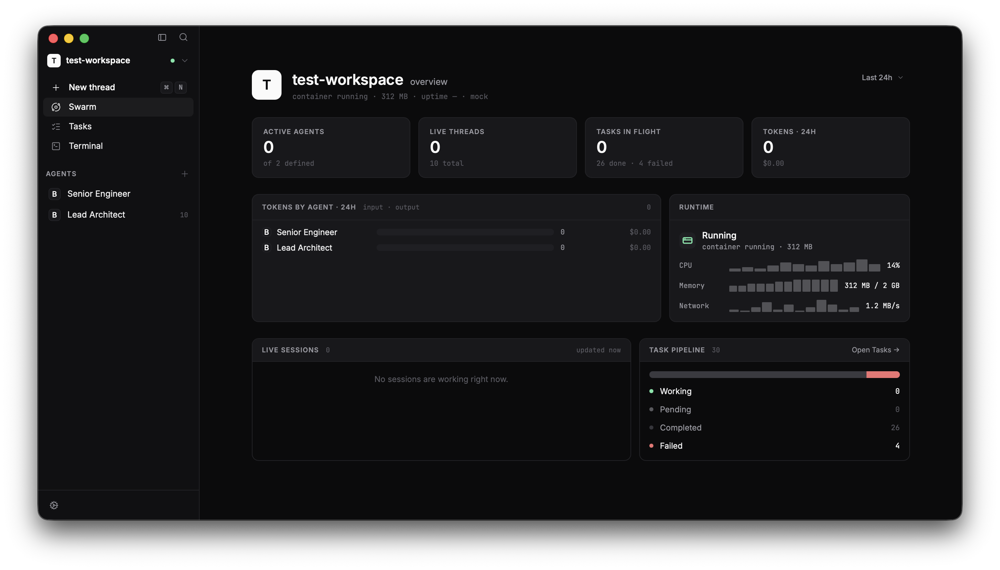

# Emergent

A desktop application for running LLM agents in parallel. Spawn multiple AI agents, orchestrate them as swarms, and watch them work on tasks concurrently — all through a native chat interface.



## Features

- **Agent Swarms** — Run multiple LLM agents side-by-side, each working independently on tasks
- **Multi-Provider Support** — Works with Claude Code, Gemini CLI, Codex, and other ACP-compatible agents
- **Real-Time Streaming** — Watch agent responses stream in with markdown rendering and thinking block display
- **Native Desktop App** — Built with Tauri 2 for a fast, lightweight experience on macOS, Windows, and Linux
- **Daemon Architecture** — Agents survive UI restarts and multiple clients can connect simultaneously

## Architecture

Emergent uses a daemon + client architecture:

- **`emergentd`** — a background daemon that manages agent lifecycles over ACP and exposes a JSON-RPC API on a Unix domain socket
- **Tauri app** — a desktop client that connects to the daemon and provides the UI

Agents keep running even when the UI is closed. Reopening the app reconnects to existing agents and replays conversation history.

## Tech Stack

- **Frontend:** Svelte 5, TypeScript, Tailwind CSS 4
- **Backend:** Rust, Tauri 2, Tokio
- **Protocol:** [Agent Client Protocol (ACP)](https://github.com/anthropics/agent-client-protocol) for agent communication
- **IPC:** Newline-delimited JSON-RPC 2.0 over Unix domain socket

## Getting Started

### Prerequisites

- [Rust](https://rustup.rs/) (1.77.2+)
- [Bun](https://bun.sh/)
- At least one supported agent CLI installed (e.g. Claude Code, Gemini CLI, Codex)

### Development

```bash
# Install dependencies
bun install

# Start the daemon (terminal 1)
cargo run -p emergent-daemon

# Start the Tauri app (terminal 2)
bun run dev
```

The daemon must be running before the app can manage agents. If the daemon is not running, the app shows a "Daemon offline" status.

#### Daemon options

By default the socket is created at `$TMPDIR/emergent-<uid>/emergentd.sock` (macOS) or `$XDG_RUNTIME_DIR/emergent/emergentd.sock` (Linux). Override with:

```bash
EMERGENT_SOCKET=/tmp/my-socket.sock cargo run -p emergent-daemon
```

Enable logging:

```bash
RUST_LOG=info cargo run -p emergent-daemon
```

### Pre-commit checks

```bash
bun run prebuild          # lint + clippy + format check + typecheck
bun run test              # Vitest unit/component tests
bun run test:rust         # Rust unit + integration tests
bun run test:e2e          # Playwright E2E tests
```

### Build

```bash
cargo build -p emergent-daemon --release   # Daemon
bun run build                              # Tauri desktop app
```

### Supported agents

| Agent       | Command                     |
| ----------- | --------------------------- |
| Claude Code | `claude-agent-acp`          |
| Codex       | `codex-acp`                 |
| Gemini      | `gemini --experimental-acp` |

## License

MIT
