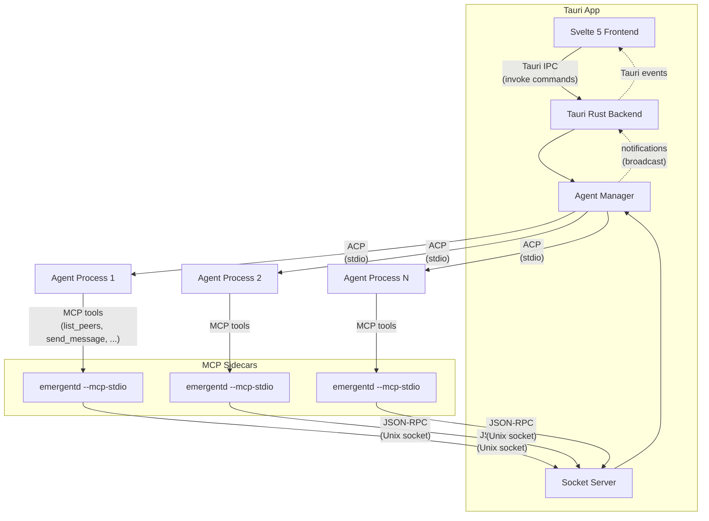

# Emergent

A desktop application for running LLM agents in parallel. Spawn multiple AI agents, orchestrate them as swarms, and watch them work on tasks concurrently — all through a native chat interface.


## Features

- **Agent Swarms** — Run multiple LLM agents side-by-side, each working independently on tasks
- **Agent Roles** — Assign optional roles to agents (e.g. "Code reviewer", "Test writer") to shape their behavior. Roles are visible in the chat and sidebar
- **Swarm Communication** — Agents can discover peers, send messages, and collaborate through built-in mailbox tools
- **Management Permissions** — Grant agents the ability to spawn, kill, and connect other agents in the swarm
- **Multi-Provider Support** — Works with Claude Code, Gemini CLI, Codex, Kiro, OpenCode, and other ACP-compatible agents
- **Real-Time Streaming** — Watch agent responses stream in with markdown rendering and thinking block display
- **Native Desktop App** — Built with Tauri 2 for a fast, lightweight experience on macOS, Windows, and Linux

## Architecture

The Tauri app embeds the agent manager directly — there is no separate daemon process. A socket server runs inside the app to serve MCP tool calls from agent sidecars.



**How it works:**

1. The **Svelte frontend** communicates with the **Tauri backend** via IPC commands
2. The Tauri backend owns the **agent manager**, which spawns agent processes (Claude Code, Gemini CLI, etc.) and communicates with them over **ACP** (stdio)
3. Each agent is injected with an **MCP sidecar** (`emergentd --mcp-stdio`) that provides swarm tools — `list_peers`, `send_message`, `read_mailbox`, `spawn_agent`, etc.
4. MCP tool calls route back to the app's **socket server** over JSON-RPC, enabling agents to discover and message each other
5. On the first prompt, the app prepends an invisible **system prompt** with a swarm collaboration guide, the agent's role (if set), and instructions for using swarm tools. Subsequent prompts may include mailbox nudges and permission change notifications
6. The agent manager pushes **notifications** (status changes, messages, permission changes) through Tauri events to the UI

## Tech Stack

- **Frontend:** Svelte 5, TypeScript, Tailwind CSS 4
- **Backend:** Rust, Tauri 2, Tokio
- **Protocol:** [Agent Client Protocol (ACP)](https://github.com/anthropics/agent-client-protocol) for agent communication
- **IPC:** Newline-delimited JSON-RPC 2.0 over Unix domain socket (for MCP sidecars)

## Getting Started

### Prerequisites

- [Rust](https://rustup.rs/) (1.77.2+)
- [Bun](https://bun.sh/)
- At least one supported agent CLI installed (e.g. Claude Code, Gemini CLI, Codex, Kiro, OpenCode)

### Development

```bash
# Install dependencies
bun install

# Start the Tauri app
bun run dev
```

### Pre-commit checks

```bash
bun run prebuild          # lint + clippy + format check + typecheck
bun run test              # Vitest unit/component tests
bun run test:rust         # Rust unit + integration tests
bun run test:e2e          # Playwright E2E tests
```

### Build

```bash
bun run build             # Tauri desktop app (includes agent manager)
```

### Supported agents

| Agent       | Command                     |
| ----------- | --------------------------- |
| Claude Code | `claude-agent-acp`          |
| Codex       | `codex-acp`                 |
| Gemini      | `gemini --experimental-acp` |
| Kiro        | `kiro-cli acp`              |
| OpenCode    | `opencode acp`              |

## License

MIT
