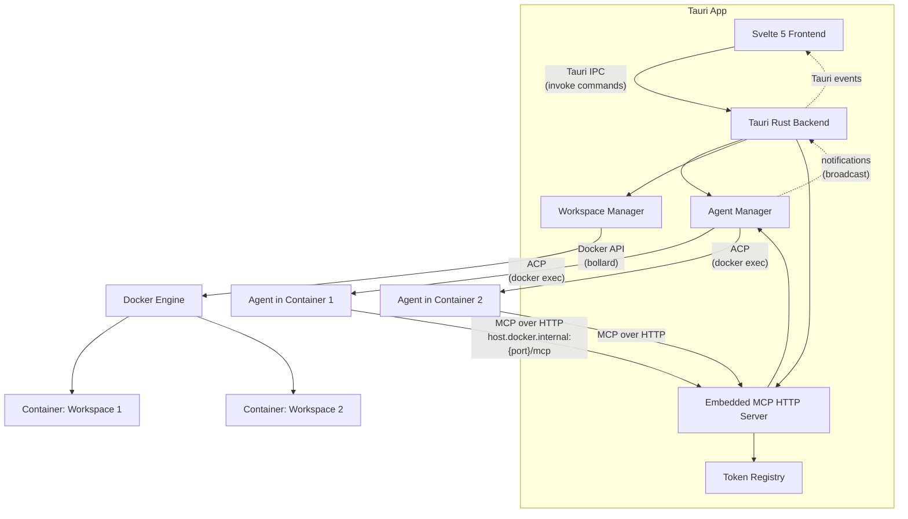

# Emergent

A desktop app for running ACP-compatible LLM agents inside Docker-backed workspaces. Create isolated environments, configure agents with roles, manage conversation threads, and watch multiple agents run side-by-side from a native desktop UI.


## Features

- **Docker-backed Workspaces** — Each workspace runs in its own container with an isolated filesystem, toolchain, and terminal
- **Configured Agents + Threads** — Define agents once, give them optional roles, and create multiple conversation threads per agent
- **Swarm Overview** — See running agents in a workspace together, including status, previews, and peer connection information
- **Workspace Tools** — Start, stop, rebuild, and manage workspace containers from the desktop UI
- **Integrated Terminal** — Open terminal sessions directly into running workspace containers
- **Multi-Provider Support** — Works with Claude Code, Gemini CLI, Codex, Kiro, OpenCode, and other ACP-compatible agents
- **Real-Time Streaming Chat** — Watch responses stream live with markdown rendering, thinking blocks, and tool call output
- **Native Desktop App** — Built with Tauri 2 for a fast, lightweight experience on macOS, Windows, and Linux

## Architecture

The Tauri app embeds the orchestration layer directly. There is no separate daemon process: the app owns the `AgentManager`, `WorkspaceManager`, and an embedded MCP HTTP server used by agent sessions.



**How it works:**

1. The user creates a **workspace**, which builds a Docker image from a Dockerfile and starts a container
2. The **Svelte frontend** communicates with the **Tauri backend** via IPC commands
3. The Tauri backend owns the **agent manager** and **workspace manager**. Agents are started inside workspace containers via `docker exec` and communicate over **ACP** (stdio)
4. Each agent thread is registered with the app's embedded **MCP HTTP server**, which is exposed to containers through `host.docker.internal:{port}/mcp` and authenticated with a per-thread bearer token
5. On the first prompt, the app can prepend an invisible **system block** with Emergent-specific instructions such as swarm guidance and the agent's configured role
6. Agent and workspace notifications flow through the Tauri backend and are emitted to the frontend as live UI updates
7. In the UI, users move between **workspace views**, **agent definitions**, and **conversation threads** while the app keeps session state persisted locally

## Tech Stack

- **Frontend:** Svelte 5, TypeScript, Tailwind CSS 4, Vite 7
- **Backend:** Rust, Tauri 2, Tokio, Axum
- **Containers:** Docker (via bollard), per-workspace isolation
- **Protocol:** [Agent Client Protocol (ACP)](https://github.com/anthropics/agent-client-protocol) for agent communication
- **MCP transport:** Streamable HTTP served by the embedded app
- **Tooling:** Bun, Vitest, Playwright, oxlint, svelte-check, Clippy

## Getting Started

### Prerequisites

- [Rust](https://rustup.rs/) (1.77.2+)
- [Bun](https://bun.sh/)
- [Docker Desktop](https://www.docker.com/products/docker-desktop/) for workspace containers
- A workspace image that includes at least one supported agent CLI

The app can launch without Docker, but workspace creation and container-backed features will be unavailable until Docker is running.

### Development

```bash
# Install dependencies
bun install

# Start the Tauri app
bun run dev
```

### Pre-commit checks

```bash
bun run prebuild          # oxlint + clippy (-D warnings) + format check + typecheck
bun run lint              # frontend / TypeScript linting
bun run lint:rust         # cargo clippy --workspace -- -D warnings
bun run fmt:check         # Prettier + oxfmt check
bun run typecheck         # svelte-check
bun run test              # Vitest unit/component tests
bun run test:rust         # Rust unit + integration tests
bun run test:e2e          # Playwright E2E tests
```

### Build

```bash
bun run build             # Tauri desktop app (includes agent manager)
```

### Supported agents

Availability is detected inside each running workspace container.

| Agent       | Command                     |
| ----------- | --------------------------- |
| Claude Code | `bunx @zed-industries/claude-agent-acp` |
| Codex       | `bunx @zed-industries/codex-acp` |
| Gemini      | `gemini --experimental-acp` |
| Kiro        | `kiro-cli acp`              |
| OpenCode    | `opencode acp`              |

## License

MIT
