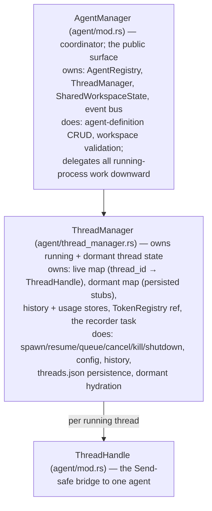
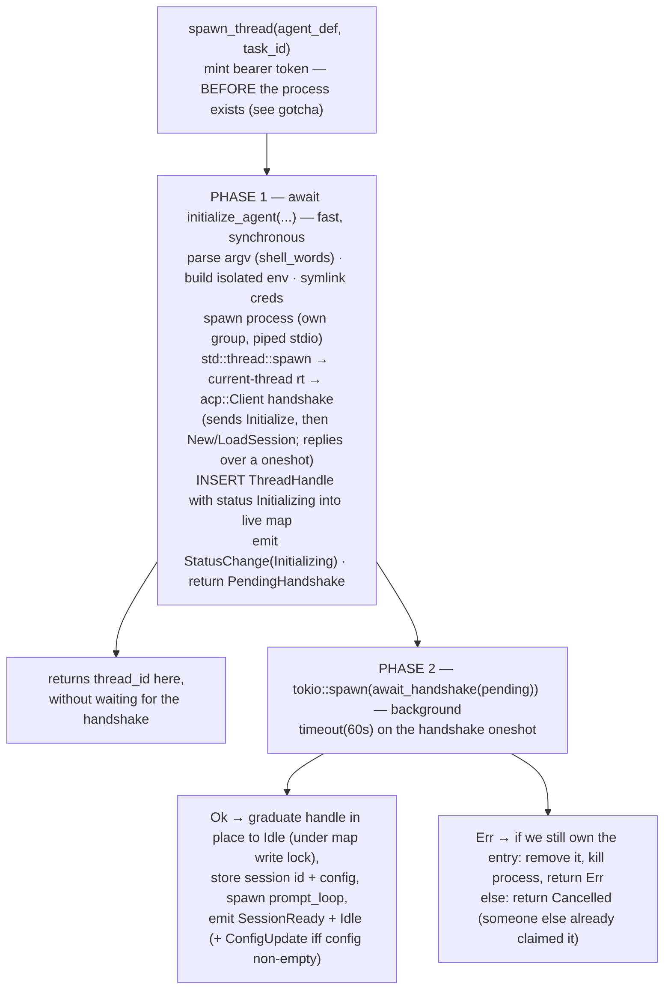
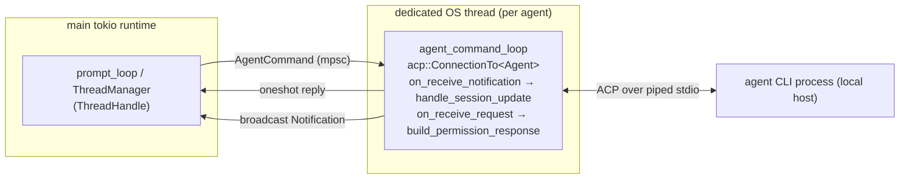

# Agent Lifecycle & the Agent Client Protocol

How Emergent starts, drives, and tears down the agent CLIs it runs, and how it speaks the Agent Client Protocol (ACP) to them. The reasoning here is the _why_ behind `crates/emergent-core/src/agent/*`: the ownership split between the managers, the two-phase cancellable spawn, the dedicated-OS-thread ACP client, the prompt loop, and the process-isolation model.

> **Canonical model (read this first).** Every agent runs as a **local host process** — a CLI launched directly with `tokio::process::Command`. There is **no Docker, no container, no `docker exec`, no bollard** anywhere in this subsystem. Isolation comes from giving each agent its own `$HOME` (with the real login Keychain and `~/.codex/auth.json` symlinked in). A few identifiers are vestigial naming, not behavior: `spawn_thread`'s doc comment says "validates the container" (it validates the _workspace_), and the MCP server is registered under the name `emergent-swarm`. CLAUDE.md and README.md still mention containers and are stale on this point. See [System Overview](./system-overview.md) for the system-wide correction and [Known Limitations](./known-limitations.md) for the doc-drift list.

Related: [Runtime Lifecycle](./runtime-lifecycle.md) (boot/recovery/shutdown that drives these APIs) · [Task & Swarm Coordination](./task-and-swarm-coordination.md) (who calls `spawn_thread`/`complete_task`) · [MCP Server & Auth](./mcp-server-and-auth.md) (the bearer token wired into every ACP session) · [Notifications & Protocol](./notifications-and-protocol.md) (the events emitted here) · [Persistence & Usage](./persistence-and-usage.md) (`threads.json`, usage accounting) · [Docs index](../README.md).

---

## 1. The three layers and their boundaries

**Why this split.** `AgentManager` is the single async-safe entry point for both the Tauri command layer and the embedded MCP handler. Keeping definition CRUD on the coordinator and all _running-process_ state in `ThreadManager` concentrates the concurrency-heavy map-of-locks logic in one place and keeps the coordinator a thin, mostly-delegating facade.

### ThreadHandle — purpose, not fields

`ThreadHandle` (`agent/mod.rs`) is the `Send`-safe object the main runtime holds for one agent; the agent's actual ACP `Client` lives on a separate OS thread (§3). The handle carries the thread's status, the `command_tx` pipe into the ACP thread, the process handle, the prompt-loop plumbing, and permission bookkeeping — see the struct for the full list. Three fields carry design meaning worth calling out:

- **`has_prompted`** gates first-turn system-block injection. On _resume_ it is initialized `true`, so a reloaded session never re-injects the first-turn swarm/task guides — the agent already saw them in its original life.
- **`completing`** is set by task-completion teardown and blocks all further prompts so the final turn can drain (see [Task & Swarm](./task-and-swarm-coordination.md)).
- **`acp_session_id`** is `None` until the handshake succeeds on a _fresh_ spawn, but `Some` from the start on _resume_ (captured up front, §2). Its nullability is load-bearing: a `None` session id means "not resumable," which drives persistence and teardown decisions (§2, §5).

---

## 2. The two-phase cancellable spawn

Spawning is split into **`initialize_agent` (phase 1)** and **`await_handshake` (phase 2)** in `agent/lifecycle.rs`, glued by a `PendingHandshake`. `spawn_thread` awaits phase 1 synchronously, then runs phase 2 on a background `tokio::spawn` and returns the `thread_id` to the caller **immediately**.

**Why two phases.** This buys the single most important property in the subsystem:

> **Invariant — the `Initializing` handle is in the live map _before_ the handshake completes.** The handle is inserted synchronously in phase 1, so the `thread_id` the caller receives is _always_ backed by a real, killable entry. There is no window where `kill_thread`/`shutdown_thread`/`delete_thread` (or the bulk workspace/agent kills) can no-op against an unregistered id.

**Trade-off.** The simpler alternative — finish the handshake, _then_ insert — leaves a gap of up to the 60s init timeout where a user who clicks "stop" on a still-initializing agent hits a phantom: the id shows in the UI but not in the map, so stop silently does nothing and the process, its OS thread, and the token all leak until the timeout fires. Two phases pay a little complexity (the `PendingHandshake` hand-off, the `Arc::ptr_eq` ownership checks) to make the thread cancellable the instant its id is known.

### Graduation and the cancellation race

`await_handshake` graduates the handle to `Idle` **in place, under the same map write lock** a concurrent kill would take. Three invariants ride on that lock:

- **`Arc::ptr_eq` guards ownership.** Both the failure and success paths re-check that the map entry still points at _our_ handle. If a stop/kill removed it mid-handshake, phase 2 returns `InitOutcome::Cancelled` and does **nothing** — no teardown, no token revoke, no error notification. The canceller already owns all of that. This is the entire reason `InitOutcome` exists.
- **`prompt_loop` is spawned while the lock is held.** Otherwise a racing kill could observe a graduated (`Idle`) handle whose `prompt_loop_handle` is still `None`, fail to abort the loop, and leak an un-abortable task.
- **Graduation notifications are emitted under the lock.** `SessionReady`/`Idle`/`ConfigUpdate` go out while the lock is held so a racing `shutdown_thread` (which emits `Dead` under the same lock, §5) can't slip a `Dead` _ahead_ of `Idle` and strand the UI showing a live thread as dead.

> **Gotcha — the 60s timeout is a leak guard, not a nicety.** A binary that launches but never speaks valid ACP would otherwise hang "initializing" forever, leaking the process, its OS thread, and the token. On timeout (or a dropped reply channel) phase 2 tears everything down and the caller revokes the token and emits `Error`.

> **Gotcha — token minted before the process.** The bearer token is registered _before_ `initialize_agent`, because the MCP server's `list_tools` must be able to answer "is this a task session?" from the token's `task_id` even before the `ThreadHandle` exists (see [MCP Server & Auth](./mcp-server-and-auth.md)). If phase 1 can't even launch the CLI, `spawn_thread` revokes immediately; if phase 2 fails or cancels, the background task handles revocation.

### Resume is the same machinery with a Load

`resume_thread` reuses `initialize_agent`/`await_handshake` verbatim, differing only in intent: it issues a `LoadSessionRequest` (not `NewSession`), captures the stored `acp_session_id` up front so the early-registered handle is already resumable (a stop mid-resume demotes it back to a dormant stub keyed by that id), starts `has_prompted = true`, and recovers the persisted `task_id` from `threads.json` first so task sessions stay callable via `complete_task` after a restart. On success the dormant stub is promoted to live; on cancel/error the dormant entry is left intact so the user can retry.

> **Invariant — resume refuses a live thread.** If the `thread_id` is already in the live map, `resume_thread` errors out, so a double-resume can't spawn two processes for one session.

---

## 3. The dedicated-OS-thread ACP client

Each agent gets its **own OS thread** running its **own current-thread Tokio runtime**, inside which `acp::Client` drives the connection over the child's piped stdio.

**Why a dedicated OS thread + its own runtime.** It fully isolates each agent's blocking ACP I/O from the shared main runtime and from sibling agents — a wedged connection can't stall other threads. The main runtime never touches the `Client` directly; it communicates only through the `AgentCommand` mpsc channel and `oneshot` replies, with `ThreadHandle` as the sole `Send`-safe bridge.

> **Gotcha — no `LocalSet`.** The ACP SDK (0.11.1) requires `Send` futures, so the older `tokio::task::LocalSet` pattern for `!Send` futures is unnecessary; a plain current-thread runtime suffices. Don't reintroduce a `LocalSet`.

### The command loop and mid-turn concurrency

`AgentCommand` (see `agent/mod.rs` for the variants) is the wire between the two runtimes: `Prompt`, `Cancel`, and `SetConfig` each carry their own `oneshot` reply channel; `Shutdown` is fire-and-forget and simply breaks the loop. `agent_command_loop` (`agent/acp_bridge.rs`) is a receive loop over that channel.

The subtlety is what happens **during an in-flight prompt**: the loop pins the prompt future and enters a `tokio::select!` so it can service _concurrent_ commands while the turn streams.

- **Why `select!`.** Cancel must reach the agent _while_ the prompt is still streaming — a "stop" that only takes effect after the turn already finished is useless. Config changes are serviced mid-turn for the same reason.
- **Gotcha — Cancel does not abort the wait.** After sending the `CancelNotification`, the loop keeps awaiting the prompt future; it relies on the agent honoring the cancel and returning a stop reason. The prompt reply still fires normally when the (now-cancelled) turn completes.
- **Gotcha — a duplicate `Prompt` mid-turn is rejected, not queued.** The in-flight case replies "Agent is already working." Combined with the single-slot queue (§4), this is Emergent's back-pressure: one turn at a time.

On completion the loop emits `TurnUsage` (if the agent reported usage) and `PromptComplete`, or `Error`, and sends the reply back to the prompt loop.

---

## 4. The prompt loop: wake → inject → send

Each graduated thread has a `prompt_loop` task (`agent/prompt_loop.rs`) spawned during graduation. It is the sole writer of a thread's `Working`/`Idle`/`Error` transitions during normal operation: it sleeps on a `Notify`, wakes when a prompt is queued, builds the prompt text, flips status to `Working`, sends `AgentCommand::Prompt`, awaits the reply, and settles to `Idle` (Ok) or `Error` (Err).

The enqueue side (`queue_prompt`) rejects a prompt up front if the thread is `completing`, already has a pending prompt, or isn't `Idle`; otherwise it stores the single prompt and wakes the loop.

> **Invariant — the prompt queue is single-slot.** At most one pending prompt per thread. A second `queue_prompt` is rejected before storage; a duplicate `Prompt` reaching the ACP thread mid-turn is rejected there too; a `completing` thread rejects everything. There is no queue depth > 1 anywhere — to send a follow-up, the previous turn must reach `Idle` first.

> **Gotcha — a failed turn is a dead end.** When a turn errors, the loop sets status to `Error` and nothing ever resets it. Because `queue_prompt` requires `Idle`, that thread can no longer accept prompts — there is no `Error → Idle` recovery path. The way back is to kill the thread (or, if the session was persisted, resume it).

**System-block injection** (`swarm::build_system_block`, `swarm/system_prompt.rs`) prepends an `<emergent-system>…</emergent-system>` block to the user turn, but **only when there is something to say** (otherwise it returns `None` and the raw user text is sent):

- **First turn** (`!has_prompted`): a swarm-awareness guide plus a note that `<emergent-system>` tags are Emergent instructions, not the user; for a task session the `update_task`/`complete_task` guide is appended.
- **Permission change**: when the thread's management-permission state differs from what it was at the last prompt, a "granted/revoked" line is injected _and_ a `SystemMessage` is emitted to the UI.

**Why prepend rather than send a system message.** ACP's `PromptRequest` carries user content; there is no separate system-role channel here, so Emergent smuggles its instructions into the user turn wrapped in a recognizable tag. The frontend strips `<emergent-system>…</emergent-system>` before display (`stripSystemBlock` in `src/stores/agents.svelte.ts`), so the injected guidance never renders as a user message (see [Frontend Architecture](../frontend/frontend-architecture.md)).

> **Gotcha — an empty computed prompt is guarded.** If the system block is `None` _and_ the user text is empty, the loop replies "Empty prompt" rather than sending a no-op turn.

> **Gotcha — `send_prompt` resolves only when the whole turn completes.** `queue_prompt` hands back a `oneshot::Receiver` that the Tauri `send_prompt` command awaits, so the IPC call returns on `PromptComplete`, not on the first token. Streaming output arrives out-of-band via broadcast notifications meanwhile. See [IPC & Events](../reference/ipc-and-events.md).

---

## 5. Live vs dormant, and kill vs shutdown vs resume

Two maps model a thread's existence: **live** (a running process + ACP session) and **dormant** (a persisted, resumable stub with no process). Teardown has two intents:

| Operation         | Process               | Live map | Dormant map                                          | threads.json       | Token     | Use case                              |
| ----------------- | --------------------- | -------- | ---------------------------------------------------- | ------------------ | --------- | ------------------------------------- |
| `shutdown_thread` | SIGTERM→SIGKILL group | removed  | **demoted to stub** (iff `acp_session_id` is `Some`) | kept               | revoked   | task-completion teardown; app quit    |
| `kill_thread`     | SIGTERM→SIGKILL group | removed  | **purged**                                           | rewritten (purged) | revoked   | user delete; agent/workspace deletion |
| `resume_thread`   | respawned             | inserted | removed on success                                   | unchanged          | re-minted | reopen a dormant session              |

**Why shutdown ≠ kill.** `shutdown_thread` keeps the session **resumable** across restarts — a task that finished cleanly should be reloadable later. `kill_thread` is a permanent purge; it is literally "shutdown, then also purge the dormant stub, persist, and clear usage snapshots."

- **Invariant — mid-handshake threads are never persisted as dormant.** `shutdown_thread` demotes to a stub only when `acp_session_id.is_some()`. A thread stopped before its handshake completed has no session id, so a stub would be a dead, un-resumable phantom. The same guard applies when rebuilding `threads.json`.
- **Invariant — `Dead` is emitted under the live-map write lock**, so it is ordered _after_ any in-flight graduation's `SessionReady`/`Idle` (emitted under the same lock, §2). Sent before the lock, a `Dead` could race ahead of a graduating thread's `Idle` and strand the UI.
- **Gotcha — kill clears usage snapshots.** Usage deltas use `saturating_sub` against per-session high-water marks keyed by `acp_session_id`. A kill+resume opens a _new_ session id; without clearing the snapshot maps, a stale high-water mark would clamp the new session's first delta to zero. See [Persistence & Usage](./persistence-and-usage.md).

---

## 6. Process spawning & isolation (`spawner.rs` · `lifecycle.rs` · `detect.rs`)

`ProcessSpawner`/`AgentProcess` are traits so the process backend is swappable and testable; the only production impl is `LocalProcessSpawner` → `LocalProcess`.

### Launch

`LocalProcessSpawner::spawn` runs the CLI via `tokio::process::Command` with piped stdio, `kill_on_drop(true)`, and:

- **argv from `shell_words`** — `parse_agent_command` splits the definition's `cli` string with shell-style quoting, so a path with spaces (e.g. `"/opt/my tools/agent" acp`) survives as one argv entry instead of being shattered by naive whitespace splitting. Empty or unbalanced-quote commands are hard errors, not silent mis-splits.
- **its own process group** (unix) — the child becomes a group leader, so the whole tree can be signalled together at teardown.
- **stderr drained to the log** on a spawned task, so a misconfigured / non-ACP binary is diagnosable _and_ the stderr pipe never fills and blocks the child.

### Isolation environment

The child's env is built explicitly (not inherited-and-mutated). `HOME` = the agent's own directory (also its cwd and the ACP session cwd) — **this is the isolation boundary**: per-agent `.claude`/`.codex` config stays separate from other agents and from the user's real home. `PATH` = `detect::enriched_path()`. `BUN_INSTALL_CACHE_DIR` points at a shared cache dir so `bunx` agents share one download cache.

> **Why pass `PATH` explicitly instead of `set_var`.** `enriched_path()` is computed once, cached in a `OnceLock`, and **never** written back to the global env. `set_var("PATH", …)` is a data race against any concurrent `getenv`/`setenv` (the process env is global and unsynchronized) and would silently leak into every child. `enriched_path` appends common login-shell dirs a GUI launch misses (`~/.local/bin`, `~/.cargo/bin`, `~/.bun/bin`, nvm/fnm dirs, `/usr/local/bin`, `/opt/homebrew/bin`) — a strict superset of the inherited `PATH`.

### The auth symlink workaround

An isolated `$HOME` breaks credential lookups that key off `$HOME`. Two best-effort symlinks fix this (failures only cost auth, so they log and continue):

- **macOS Keychain** — keychain-backed CLIs (e.g. Claude Code) read their OAuth token from the login Keychain, which the Security framework locates via `$HOME/Library/Keychains`. The isolated `$HOME` points there at an empty dir → "Not logged in." Fix: symlink the real `~/Library/Keychains` into the agent home. (The agent already runs as the user, so this grants no new access.)
- **Codex `auth.json`** — Codex reads `$CODEX_HOME/auth.json` (default under `$HOME`), not the keychain. Fix: symlink the real `~/.codex/auth.json` into the agent's `.codex`.

> **Gotcha — Codex is symlinked, never copied, on purpose.** OpenAI rotates refresh tokens **in place** (each single-use) and Codex rewrites `auth.json` on refresh. A _copy_ would let the first agent to refresh consume the shared single-use token and silently log out the user _and every sibling agent_. A symlink means all agents share one physical file, so a refresh writes back to the single source of truth.

### Teardown: signal the whole group

`LocalProcess::shutdown` does **SIGTERM the process group → wait up to the timeout → SIGKILL the group**, via a direct `killpg` syscall (async-signal-safe, non-blocking, no subprocess). `Drop` also sweeps the group with SIGKILL.

> **Why group signals, not just `child.kill()`.** `kill_on_drop(true)` only SIGKILLs the _direct_ child, but agents are typically `bunx → node → …`; killing only the direct child orphans the grandchildren and any MCP helpers. Signalling the whole group (led by the child) guarantees the tree dies together. The always-run SIGKILL sweep after SIGTERM covers grandchildren that ignore or are slow on SIGTERM even when the leader exits promptly.

### Which agents can be launched (`detect.rs`)

`known_agents_on_host()` returns a fixed table of known agent CLIs (Claude Code, Codex, Gemini, Kiro, OpenCode) with per-agent availability computed by `which_in` against the _enriched_ PATH — so detection sees the same dirs the spawned agents will. Claude Code and Codex run via `bunx` and require both `bunx` and their provider binary on PATH; the rest are self-contained. See the `KNOWN_AGENTS` table for the exact commands and provider ids.

> **Gotcha — the `known_agents` Tauri command is host-global,** not workspace-scoped. This table is a _suggested_ command surface for the UI — an `AgentDefinition.cli` can be any command string, not just these rows.

---

## 7. ACP → Notification mapping (`handle_session_update`)

`handle_session_update` (`agent/acp_bridge.rs`) is the ACP `on_receive_notification` handler; it translates each `SessionUpdate` into zero or more broadcast `Notification`s. Assistant and thought chunks become `MessageChunk` (tagged `message`/`thinking`); tool calls and updates become `ToolCallUpdate`; user chunks become `UserMessage` (with the echo tag below); config and usage updates become `ConfigUpdate`/`TokenUsage`. `Plan` is logged only; other/future variants are ignored in v1. See [Notifications & Protocol](./notifications-and-protocol.md) for the full event catalog and the broadcast→Tauri bridge.

### Echo tagging: the `expect_echo` flag

When Emergent sends a prompt, some agents echo the user turn back as `UserMessageChunk`s. Emergent must distinguish _that_ echo (already shown optimistically in the UI) from _spontaneous_ user-role messages (e.g. from a sub-agent). It coordinates via a single `AtomicBool` shared between the command loop and the notification handler:

1. The command loop sets `expect_echo = true` just before sending each manager-initiated `Prompt`.
2. The notification handler, on the **first** `UserMessageChunk`, swaps the flag to `false` — that one chunk is tagged `is_echo: true`; all later chunks get `false`.
3. The command loop **unconditionally clears** the flag at every turn boundary.

> **Gotcha — step 3 exists because some agents (e.g. Claude Code) emit _zero_ `UserMessageChunk`s.** Without the turn-boundary clear, an armed-but-never-consumed flag would leak into the _next_ turn and wrongly tag its first user chunk as an echo. The regression test `expect_echo_flag_cleared_after_zero_chunk_turn` locks this in.

### Permission requests are auto-approved

`build_permission_response` always selects the **first** offered option (or `Cancelled` if none). There is **no interactive permission gating** in this layer — agents run with whatever they ask for. The UI has an unused "permission" glyph; an interactive flow is future work (see [Known Limitations](./known-limitations.md)).

---

## 8. Config options: Select-only, with diffing (`config.rs`)

`convert_config_options` maps ACP `SessionConfigOption`s to Emergent's `ConfigOption`, but drops everything that isn't a `Select` (and any unknown options-collection variant). Categories are normalized to `model` / `thought_level` / `mode` / passthrough-`other`.

> **Trade-off — Select-only is deliberate for v1.** Emergent renders config as dropdown pills (model, thinking level, mode). Non-select ACP option kinds have no UI, so they're filtered out rather than half-rendered. The cost: agents exposing richer config surfaces lose those knobs in Emergent.

`diff_config` produces human-readable change entries (option name + the _display name_ of the new value) for changed or newly-appeared options. It feeds only the `changes` field of `ConfigUpdate` notifications, and only when non-empty — never the `set_config` reply (which returns the full converted config). The initial `ConfigUpdate` at graduation hard-codes empty `changes` and is emitted **only when the initial config is non-empty**, so an agent with no `Select` options (e.g. a bare/mock agent) emits `SessionReady` + `Idle` and no `ConfigUpdate`.

- **Gotcha — `set_config` only emits `ConfigUpdate` when something actually changed**, avoiding spurious UI churn.
- **Gotcha — on resume, the loaded config wins.** `initial_config_from_load_response` prefers the `LoadSessionResponse` config over the cached notification config, so a reloaded session reflects the agent's authoritative current settings, not a stale snapshot. Covered by `load_response_config_takes_priority_on_resume`.

---

## 9. Persistence, history, and usage (pointers)

`ThreadManager` also owns per-thread notification **history** and per-workspace **usage** aggregation, driven by a background **recorder task** that subscribes to the broadcast channel: it appends every notification into history (keyed by `thread_id`) and folds `TurnUsage`/`TokenUsage` deltas into the usage stores, persisting `threads.json` after each accounted turn. Two facts intersect the lifecycle:

- **`threads.json` is rebuilt from the authoritative in-memory maps, never re-read to mutate**, with writes serialized by a persist lock and done via temp-file + atomic rename — no torn files, no resurrecting a just-removed mapping.
- Usage is keyed by `acp_session_id` with cumulative-value snapshots and `saturating_sub` deltas (see §5's kill-clears-snapshots note).

Full detail — the persisted-state envelope, cumulative-vs-delta correction, and the frontend usage path — lives in [Persistence & Usage](./persistence-and-usage.md).

---

## 10. Quick invariant/gotcha checklist

- **Insert the `Initializing` handle before the handshake** → the returned `thread_id` is always cancellable (no phantom).
- **`Arc::ptr_eq` wherever the map is re-checked** → a concurrent kill/stop always wins; `await_handshake` returns `Cancelled` and defers teardown.
- **Graduation + `Dead` both emitted under the live-map write lock** → status events can't reorder.
- **`prompt_loop` spawned under the map lock at graduation** → no un-abortable-task leak on a racing kill.
- **Single-slot prompt queue** → one turn at a time; a second/duplicate prompt is rejected, not queued.
- **A failed turn lands in `Error` with no path back to `Idle`** → recover by killing or resuming, not re-prompting.
- **Dedicated OS thread + current-thread runtime per agent; `ThreadHandle` is the only `Send` bridge** → agents can't stall each other's I/O.
- **`select!` in the command loop** → cancel/config reach the agent _mid-turn_.
- **`expect_echo` cleared at every turn boundary** → zero-chunk turns don't mis-tag the next turn.
- **Group SIGTERM→SIGKILL (+ Drop sweep)** → `bunx→node` grandchildren never orphaned.
- **Codex `auth.json` symlinked, not copied** → single-use refresh-token rotation doesn't log everyone out.
- **`PATH` passed explicitly, never `set_var`** → no global-env data race.
- **Dormant demotion requires `acp_session_id.is_some()`** → no dead phantom stubs.
- **Kill clears usage snapshots** → resumed sessions aren't delta-clamped to zero.

---

_Back to the [Docs index](../README.md). Neighbors: [Runtime Lifecycle](./runtime-lifecycle.md) · [Task & Swarm Coordination](./task-and-swarm-coordination.md) · [MCP Server & Auth](./mcp-server-and-auth.md) · [Notifications & Protocol](./notifications-and-protocol.md) · [Persistence & Usage](./persistence-and-usage.md)._
