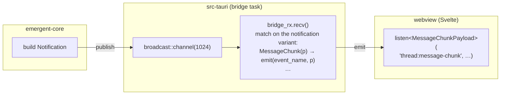

# Notifications, Events & the Wire Protocol

How the backend pushes events to the UI. This document covers `emergent-protocol` as the single shared wire contract, the one-way `Notification` broadcast that feeds the Tauri-to-webview pipeline, the deliberate asymmetry between the _live_ event form and the _replayed_ history form, and why terminal output travels out-of-band.

See also: [System Overview](./system-overview.md) · [Agent Lifecycle & ACP](./agent-lifecycle-and-acp.md) (where `Notification`s are minted) · [Workspaces & Terminals](./workspaces-and-terminals.md) (the terminal sink) · [Task & Swarm Coordination](./task-and-swarm-coordination.md) · [Persistence & Usage](./persistence-and-usage.md) (history + usage folding) · [IPC & Events Reference](../reference/ipc-and-events.md) (the command side) · [Docs index](../README.md).

---

## 1. `emergent-protocol`: the shared contract

`emergent-protocol` is a tiny, logic-free crate whose entire job is to be the _one_ place where the producer (`emergent-core`) and the consumers (the Tauri bridge in `src-tauri/` and the Svelte stores in `src/`) agree on serde-serializable types. It has no runtime behavior beyond derives and a few accessors.

Two distinct kinds of type live here, and confusing them is the first trap:

1. **Event payloads** — pushed one-way from backend to UI, wrapped in the `Notification` enum. This document is mostly about these.
2. **Value types** — request/response shapes for IPC commands (`WorkspaceInfo`, `ThreadSummary`, `KnownAgent`, `AgentDefinition`, …). These travel over `invoke()` return values, not events, and are documented alongside the commands in [IPC & Events Reference](../reference/ipc-and-events.md).

> **Why a separate crate?** Both `src-tauri` and `emergent-core` depend on it, but it depends on neither — no Tauri, no Tokio, no process-management concerns. That keeps the wire vocabulary neutral and lets the frontend hand-mirror the same field names in TypeScript with confidence that there is exactly one source of truth.

---

## 2. `Notification`: one closed enum

`Notification` (in `emergent-protocol`) is a closed enum: every backend-to-client event is a variant wrapping exactly one payload struct. **The full set of events is this enum — read it there for every variant and payload; this doc does not re-list them.**

Two structural properties are load-bearing:

- **Internally tagged** (`#[serde(tag = "type")]`). When serialized _as a `Notification`_, the discriminator lands in a `"type"` field and the payload's fields are flattened alongside it: `{"type":"thread:message-chunk","thread_id":"…","content":"…","kind":"message"}`.
  > **Invariant:** internal tagging only works because every payload is a _struct_ (a JSON object). A variant wrapping a tuple, primitive, or newtype-of-primitive would be rejected by serde's internal-tag representation at (de)serialize time. New events must introduce a named payload struct.
- **Colon-namespaced variant renames.** Each variant's `#[serde(rename)]` is its channel string, and the prefix is a routing convention the frontend leans on:

  | Namespace    | Covers                                                                                                        |
  | ------------ | ------------------------------------------------------------------------------------------------------------- |
  | `thread:*`   | per-thread conversational activity — message chunks, tool calls, status, config, usage, errors, session-ready |
  | `task:*`     | task lifecycle (created/updated) and per-thread task-status notifications                                     |
  | `agent:*`    | agent-definition create/delete                                                                                |
  | `terminal:*` | PTY output and exit (delivered out-of-band — see §4)                                                          |

  `task:*` events are minted when agents invoke the `create_task` / `update_task` / `complete_task` MCP tools; the read-only `list_tasks` / `list_agents` tools produce no events.

### 2.1 The two accessors

`Notification` exposes `event_name()` (the channel string, identical to the variant's `#[serde(rename)]`) and `thread_id()` (the owning thread for routing into a chat view). `event_name()` exists so the bridge can pick the Tauri event channel **without serializing the enum** (see §3).

> **Gotcha — two hand-kept lists.** The `#[serde(rename)]` attributes and the `event_name()` match arms are independent copies of the same channel strings; no macro ties them together. A mismatch would silently route events to the wrong channel. Edit both when you add or rename a variant.

`thread_id()` is **not** uniform: thread-scoped conversational events return `Some`, while cross-cutting events (task create/update, agent-definition, terminal) return `None`.

> **Gotcha:** `TaskStatusNotification` returns `Some`, but the id is its `creator_thread_id` — the thread that _created_ the task, not the one running it. That is the routing you want (the notification is shown to whoever asked for the task), but do not assume `thread_id()` always points at the thread the event is _about_.

---

## 3. The live pipeline: broadcast → bridge → webview

There is one notification channel in the whole app, created once at startup in `src-tauri/src/lib.rs` as a bounded `broadcast::channel` (1024 slots). `emergent-core` producers publish onto it; several consumers subscribe — the notification **bridge** (the one that reaches the UI), the `TaskManager` event loop, and a usage/history **recorder**.

The bridge does something subtle: for each variant it emits **only the inner payload `p`**, keyed by `event_name()`. The `Notification` enum itself is never serialized on the live path.

### 3.1 The wire asymmetry (read this twice)

The single most important thing about the protocol: **the same event has two on-wire shapes depending on how it reaches the UI.**

|                       | Live push (bridge `emit`)                          | History replay (`get_history`)                                  |
| --------------------- | -------------------------------------------------- | --------------------------------------------------------------- |
| Serialized as         | the inner payload struct                           | the full `Notification` enum                                    |
| `"type"` tag present? | **No** — the channel name is the discriminator     | **Yes** — internally tagged                                     |
| Example JSON          | `{"thread_id":"…","content":"…","kind":"message"}` | `{"type":"thread:message-chunk","thread_id":"…","content":"…"}` |
| Frontend type         | payload struct via `listen<T>(channel, …)`         | `DaemonNotification` tagged union                               |

> **Why strip the tag on the live path?** Tauri's event system _already_ carries the channel name via `emit(event_name, …)`, so a `"type"` field would be redundant — and worse, it would force every `listen()` handler to reach through a wrapper to get its fields. Emitting the bare payload lets the frontend write `listen<MessageChunkPayload>("thread:message-chunk", …)` with a clean, exact type.

> **Why keep the tag on the replay path?** `get_history` returns a `Vec<Notification>` — a heterogeneous list of many event kinds for one thread. A mixed array _needs_ an in-band discriminator to be parsed, so the internally-tagged form is the natural representation there.

> **Invariant:** the `event_name()` string (live channel) and the `#[serde(rename)]` string (replay `"type"`) are used in different places but must stay equal, or the live and replayed forms of the same event would diverge.

### 3.2 The bridge is resilient, not lossless

The bridge tolerates a slow webview: on `RecvError::Lagged(n)` it logs and keeps going; on `Closed` it stops.

> **Trade-off:** the channel is bounded. Under a burst that outruns the bridge, `broadcast` _drops the oldest events_ and reports `Lagged(n)` rather than blocking the producer. The UI can therefore miss streaming chunks during a storm; the design accepts stale/missing text over back-pressuring the agent. The `TaskManager` subscriber handles the same `Lagged` signal more defensively, reconciling task state after a gap — see [Task & Swarm Coordination](./task-and-swarm-coordination.md).

---

## 4. The terminal exception: out-of-band delivery

`Notification::TerminalOutput` and `TerminalExited` exist in the enum (and in both accessors), but in the bridge match they are **explicit no-ops**. Terminal data instead travels through `TauriTerminalSink` (in `src-tauri/src/lib.rs`), which implements `emergent_core::workspace::terminal::TerminalEventSink` and calls `AppHandle::emit` directly on the `terminal:output` / `terminal:exited` channels.

> **Why bypass the broadcast?** A shell spewing megabytes (e.g. `cat` on a large file) would flood the bounded channel and, via `Lagged`, _evict unrelated agent notifications_ — message chunks, status changes, task updates. Giving the PTY its own direct-to-webview path means a noisy terminal can only ever hurt itself.

> **Key insight — same channel, same payload, different road.** From the webview's point of view there is _no difference_: it still receives `terminal:output` events carrying a `TerminalOutputPayload`. Only the Rust delivery path differs (direct `AppHandle::emit` vs. the broadcast bridge). The `Notification::Terminal*` variants remain in the enum only to keep the type set complete and the bridge match exhaustive; they are dead on the broadcast path.

> **Gotcha when debugging:** grep the bridge for where `terminal:output` is emitted and you will find a no-op and conclude it is never sent. It _is_ sent — from `TauriTerminalSink`, not the bridge. Trace terminal events through the sink.

> **Trade-off (documented in the sink):** `emit` is fire-and-forget with no drain signal, so a command whose output outpaces the webview's render rate grows the webview event queue without bound. This was chosen over the broadcast's eviction behavior; consumer-paced bounding of terminal output is a tracked hardening follow-up. See [Workspaces & Terminals](./workspaces-and-terminals.md).

---

## 5. Serde conventions you will trip over

- **snake_case is the default.** Most payload structs carry no `#[serde(rename_all)]`, so fields serialize in Rust's snake_case: the frontend sees `thread_id`, `tool_call_id`, `stop_reason`, `acp_session_id`, `creator_thread_id`, etc.

  > **Gotcha:** this is the opposite of the usual JS convention. The TypeScript payload mirrors in `src/stores/types.ts` must use snake_case to match — do not "fix" them to camelCase.

- **`ToolCallContentPayload` renames _variants_, not fields.** It is the one `rename_all = "camelCase"` type, and because it is internally tagged that renames the _variant tags_ (`Text → "text"`, `Diff → "diff"`, `Terminal → "terminal"`) — which is why a diff item serializes as `{"type":"diff", …}`. Serde has no `rename_all_fields`, so the fields inside (`old_text`, `new_text`, `exit_code`, …) stay snake_case. This nested enum is the value of `ToolCallEventPayload.content`.

- **Optional fields come in two flavors — know which.** Fields marked `#[serde(skip_serializing_if = "Option::is_none")]` are **omitted** when `None` (never `null`). Plain `Option<…>` fields with no skip attribute are **always present** and serialize to `null` when absent — e.g. `ToolCallEventPayload`'s `title`/`kind`/`status`/`locations`/`content` are `null`-when-absent, while its `raw_input`/`raw_output` are omitted. Frontend readers must handle both. `TurnUsagePayload` goes further, omitting _zero_ cached/thought token counts via a custom `skip_serializing_if` plus `#[serde(default)]` so the round-trip stays lossless; treat a missing count as `0`.

- **`TerminalOutputPayload.data` is base64.** PTY output is arbitrary bytes (ANSI escapes, partial UTF-8, control chars) that are not valid JSON strings, so a private `base64_bytes` serde module encodes/decodes with the STANDARD engine. The encoding lives in the type, so both delivery paths (broadcast and sink) get it for free; the frontend decodes before feeding xterm.js.

- **`Task` flattens its state.** `TaskState` (in `emergent-protocol`) is internally tagged on `status`, and `Task` `#[serde(flatten)]`s it, so `status` and (for non-`Pending` states) `session_id` appear at the **top level** of a serialized task, not nested under a `state` key.

  > **Gotcha — the `session_id` name lies.** Per its doc comment, `session_id` stores the backend **`thread_id`** returned by `AgentManager::spawn_thread`, _not_ the ACP session id; the name is kept for wire compatibility. Read it as "thread id".
  > **Trade-off of flattening:** flat, ergonomic JSON, but `status`/`session_id` now share `Task`'s namespace, so no `Task` field may be named either.

- **`AgentStatus` is not a wire type.** The `AgentStatus` enum exists with a lowercasing `Display` impl, but `StatusChangePayload.status` and `ThreadSummary.status` are plain `String`s that _happen_ to be produced from `AgentStatus::to_string()`. Do not assume the field is constrained to that set at the type level.

- **`ConfigSelectOptions` is `untagged` and structurally fragile.** Serde distinguishes its two arms purely by shape (an option has `value` + `name`; a group has `label` + `options`), trying each in order and picking the first that parses.
  > **Gotcha:** if the two structs ever gained overlapping field sets, deserialization could silently pick the wrong arm. The distinctness is a load-bearing, documented assumption.

---

## 6. How the frontend subscribes and replays

Live events are folded into reactive `$state` by a small set of rune stores in `src/stores/`, split by concern: the bulk of thread activity (message chunks, tool calls, status, config, errors, session-ready, token usage, and task-status notifications) lands in the agents store, where streaming text is coalesced per animation frame and tool-call updates accumulate into a single tool-group message; cross-cutting UI state (task created/updated) lands in the app-state store; and per-turn token accounting lands in the usage store. See [Frontend Architecture](../frontend/frontend-architecture.md). Note that the `agent:definition-*` channels are emitted by the bridge but have no frontend listener — agent-definition changes reach the UI through IPC return values and optimistic store updates instead.

### 6.1 The replay path

When a chat view is (re)opened, the frontend calls `get_history(thread_id)` and feeds the result to `replayNotifications()` in the agents store. That function is typed against a `DaemonNotification` tagged union — the **only** place the `"type"`-tagged form is consumed.

> **Gotcha:** the replay union covers only the thread-scoped _conversational_ variants, a subset of the enum. The recorder task (in `emergent-core`'s `thread_manager`) appends into per-thread history only where `Notification::thread_id()` returns `Some`, so history _can_ contain non-conversational thread-scoped entries (e.g. `thread:token-usage`, or `task:status-notification` routed by `creator_thread_id`), but `replayNotifications()` simply ignores anything outside the union. Cross-cutting events whose `thread_id()` is `None` (`task:created`/`task:updated`, `agent:*`, `terminal:*`) are never stored, so they can never appear in replay at all. Replay reconstructs the _conversation_; usage and task state are rebuilt from other sources on boot. See [Persistence & Usage](./persistence-and-usage.md).

---

## 7. Adding a new event (checklist)

1. Define a payload **struct** in `emergent-protocol` (or reuse one). Keep fields snake_case; add `skip_serializing_if = "Option::is_none"` to any `Option` you want omitted rather than `null`.
2. Add a variant to `Notification` with `#[serde(rename = "namespace:kebab-name")]`.
3. Add the matching arm to **both** `event_name()` and `thread_id()`.
4. Add an `emit(event_name, p)` arm to the exhaustive bridge match in `src-tauri/src/lib.rs` (it will not compile until you do). For out-of-band events like terminal, add a no-op arm and emit via the relevant sink instead.
5. Mirror the payload type in `src/stores/types.ts` and add a `listen<T>()` in the appropriate store.
6. If the event should survive `get_history` replay, add it to the `DaemonNotification` union and handle it in `replayNotifications()`.
7. Add/extend a serde round-trip test next to the existing `*_notification_roundtrips` tests.

> **Invariant to preserve:** steps 2 and 3 must use identical strings, and the live payload (step 4) must serialize to the same field set as the tagged replay form minus the `"type"` key. If those drift, live and replayed renderings of the event will disagree.

---

## Related documentation

- [IPC & Events Reference](../reference/ipc-and-events.md) — the command (`invoke`) side and a companion channel table.
- [Agent Lifecycle & ACP](./agent-lifecycle-and-acp.md) — where ACP `SessionUpdate`s are mapped into `Notification`s.
- [Workspaces & Terminals](./workspaces-and-terminals.md) — the `TerminalEventSink` out-of-band path in full.
- [Task & Swarm Coordination](./task-and-swarm-coordination.md) — how `task:*` events are produced and how the `TaskManager` subscriber handles `Lagged`.
- [Persistence & Usage](./persistence-and-usage.md) — history recording and the token/cost usage pipeline behind `thread:token-usage` / `thread:turn-usage`.
- [System Overview](./system-overview.md) · [Docs index](../README.md)
