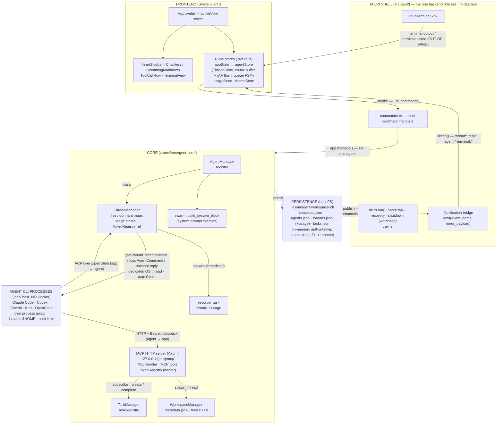
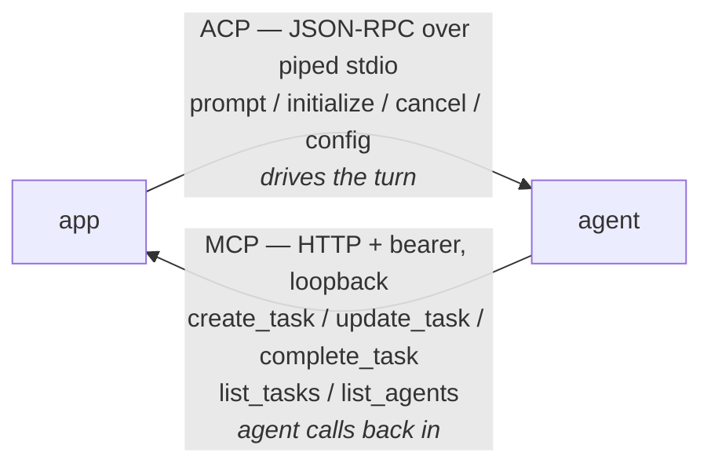

# System Overview & Design Decisions

Emergent is a Tauri 2 desktop app that runs multiple LLM coding agents in parallel, each as an isolated **local host process**, coordinated through a chat UI. This is the entry point for the architecture docs: it maps the system end-to-end and explains the _why_ behind the load-bearing decisions, so the rest of the docs can hang off it.

> Back to the [documentation index](../README.md).

---

## Correction up front: no Docker, no daemon

Two claims in the repo's top-level `CLAUDE.md` and `README.md` are **stale**, and are corrected here as canonical:

1. **There are no containers.** Despite prose describing "per-workspace Docker containers driven over `docker exec`", the shipping code uses no Docker anywhere — no `bollard` dependency, no `docker exec`, no container module under `workspace/`. Each agent is a **local host process**; terminals are host PTYs.
2. **There is no separate daemon.** The entire backend is embedded in the Tauri app. Any residual "daemon" wording in the code (e.g. "daemon-to-client" doc comments) is vestigial phrasing from an earlier architecture, not a running process.

Docker is mentioned in these docs only to say it is **not** used. If you arrived from the README expecting containers, stop reasoning about them — the `$HOME`-isolation story below replaces them entirely.

---

## The pieces

Four Rust crates plus a Svelte frontend, all in one Cargo workspace (`default-members = ["crates/*"]`).

| Piece                   | Path                        | Role                                                                                                                                                                                                                                         |
| ----------------------- | --------------------------- | -------------------------------------------------------------------------------------------------------------------------------------------------------------------------------------------------------------------------------------------- |
| **Tauri shell**         | `src-tauri/`                | The desktop app. Owns and embeds all managers, runs the notification bridge and MCP server, exposes the IPC command surface, and hosts the webview. This _is_ the "backend process".                                                         |
| **`emergent-core`**     | `crates/emergent-core/`     | The engine: agent orchestration (`agent/`), workspaces + host PTY terminals (`workspace/`), the MCP server (`mcp/`), task graph (`task/`), system-prompt injection (`swarm/`), agent detection (`detect`), ACP config conversion (`config`). |
| **`emergent-protocol`** | `crates/emergent-protocol/` | The shared wire contract: the `Notification` enum, payload structs, `Task`/`TaskState`, `AgentDefinition`, config option types, IDs. Depended on by every layer so the Rust and TypeScript sides agree on shapes.                            |
| **`mock-agent`**        | `crates/mock-agent/`        | A test-only ACP agent whose behavior is driven by prompt substrings, so the Rust suite can exercise the full spawn → prompt → stream → complete path with no real CLI or network.                                                            |
| **Frontend**            | `src/`                      | Svelte 5 + TypeScript. Rune stores (`.svelte.ts`) fold Tauri events into reactive `$state`; components render streaming Markdown, tool calls, and terminals.                                                                                 |

**Why the crate split (`core` vs `protocol`):** the protocol crate carries only serde types with no logic, so it can be a leaf dependency of both `emergent-core` and `src-tauri` without pulling in Tokio, Axum, or PTY machinery. The frontend mirrors these shapes in TypeScript. This is the single source of truth for anything crossing a process or language boundary.

---

## Top-level component diagram

> **Shared wire types:** `emergent-protocol` carries the `Notification` enum plus its payload structs, and is depended on by every layer above.

The two channels crossing the agent boundary are the heart of the design: **ACP flows app→agent over piped stdio**, and **MCP flows agent→app over loopback HTTP**. They are described next.

---

## The dual-channel design: ACP down, MCP up

Each agent talks to the app over two independent channels, deliberately kept separate:

### ACP — the control channel (app → agent)

When a thread spawns, `initialize_agent` (in `lifecycle`) launches the CLI with **piped stdio** in its own process group and wraps that stdio as an ACP transport. A **dedicated OS thread per agent** runs the `acp::Client`, bridged to the main Tokio runtime by a `ThreadHandle` carrying an mpsc `AgentCommand` channel plus oneshot replies. The app drives the session — initialize, new/load session, prompt, cancel, config changes all go **down** this channel. Agent output (message chunks, tool calls, usage) comes back **up** the same stdio as ACP session updates, which `handle_session_update` maps into `Notification`s.

- **Why a dedicated OS thread per agent:** the ACP client library wants to own a current-thread runtime; giving each agent its own thread keeps the borrow/`Send` story simple and isolates one agent's blocking behavior from the rest.
- **Invariant:** an agent process is always launched with its own process group. Teardown signals the _whole group_ (SIGTERM → SIGKILL) so `bunx → node` grandchildren (Claude Code, Codex) are never orphaned.

### MCP — the coordination channel (agent → app)

Agents don't just receive prompts; they call _back into the app_ to coordinate work. The app embeds an Axum-based **MCP streamable-HTTP server** bound to `127.0.0.1:{random port}`. Agents reach it via an MCP config injected into their ACP session (the loopback URL plus an `Authorization: Bearer` token). The tools are `create_task`, `update_task`, `complete_task`, `list_tasks`, and `list_agents` — but `McpHandler::list_tools` gates `update_task`/`complete_task` to task sessions, so a conversation session sees only `create_task`, `list_tasks`, and `list_agents` (detailed in [mcp-server-and-auth.md](./mcp-server-and-auth.md)).

- **Why loopback HTTP rather than piping tool calls through ACP:** it lets standard MCP-capable CLIs discover and call the tools with zero Emergent-specific glue, and it cleanly separates "the app tells the agent what to do" (ACP) from "the agent asks the app to change shared state" (MCP).
- **Invariant / security:** the MCP server binds loopback-only. This is safe _precisely because agents are local host processes_ on the same machine — there is no network surface.

> **Gotcha — the MCP task tools are the inter-agent coordination path.** `create_task` can spawn a _dependent_ agent thread; `complete_task` marks a thread completing and queues teardown. There is no message bus and no connection graph between agents. Read [task-and-swarm-coordination.md](./task-and-swarm-coordination.md) before assuming "swarm" means message passing.

---

## The local-process agent model, and why

Isolation does **not** come from containers. Each agent runs as a plain host subprocess whose `$HOME` (and cwd) is set to a **per-agent directory** by `initialize_agent`. That per-agent `$HOME` is the isolation boundary: config, caches, and per-agent state stay separate from sibling agents and from the real user home.

The problem this creates — and how it's solved — is the interesting part:

- **OAuth credentials must still work.** A fresh isolated `$HOME` would break login, so `initialize_agent` **symlinks the real credentials in**:
  - **macOS Keychain:** `~/Library/Keychains` is symlinked into the agent home, because the Security framework locates the login keychain via `$HOME`. Keychain-backed CLIs (e.g. Claude Code) then read their OAuth token normally.
  - **Codex `auth.json`:** the real `~/.codex/auth.json` is symlinked in. Codex is _not_ keychain-backed and **rewrites `auth.json` in place** on token refresh (OpenAI refresh tokens are single-use), so a symlink — not a copy — is required for the refresh to be visible to every sibling agent.
  - Both are **best-effort**: a failed symlink only costs auth for that one agent, so the code logs and continues.

- **`PATH` must include login-shell dirs.** GUI apps launch without the login shell's `PATH`. `detect::enriched_path()` computes an augmented `PATH` once (adding `~/.local/bin`, `~/.cargo/bin`, `~/.bun/bin`, `/opt/homebrew/bin`, …) and hands it explicitly to spawned agents and terminals. It deliberately **does not** mutate the global `PATH` — that would be a data race against concurrent getenv/setenv.

### Why local processes instead of containers

| Concern            | Container approach                                  | Local-process approach (shipping)                                                |
| ------------------ | --------------------------------------------------- | -------------------------------------------------------------------------------- |
| Credentials        | Must mount/copy secrets in; keychain access is hard | Real Keychain / `auth.json` symlinked into isolated `$HOME` — OAuth "just works" |
| Startup cost       | Image build + container start per workspace         | `spawn()` a subprocess — near-instant                                            |
| Docker dependency  | Requires Docker Desktop running                     | Zero external daemons                                                            |
| Isolation strength | Strong (namespaces/cgroups)                         | Weaker: per-`$HOME` only, shared filesystem/network                              |

**Trade-off:** the local model trades the strong isolation and reproducibility of containers for a dramatically simpler credential story, instant startup, and no Docker dependency. The cost is that agents share the host filesystem and network, separated only by `$HOME`. This was decisive: real coding CLIs authenticate via keychain/OAuth, which is painful to reproduce inside a container but trivial to symlink on the host.

> **Gotcha — no interactive permission gating.** ACP permission requests are auto-approved (the code picks the first option). Combined with the shared-filesystem model, an agent can touch anything the user can. There is a vestigial "permission" glyph in the UI but no enforcement layer. See [known-limitations.md](./known-limitations.md).

Full detail lives in [agent-lifecycle-and-acp.md](./agent-lifecycle-and-acp.md).

---

## Embedded-in-Tauri: one process, `Arc`-shared managers

`run()` in `src-tauri/src/lib.rs` _is_ the whole backend. Its `setup` closure creates one bounded `broadcast::channel<Notification>`, builds the managers (`WorkspaceManager`, `TokenRegistry`, `AgentManager` with its background usage/history **recorder task**, `TaskManager` subscribing to the broadcast), starts the MCP server, rehydrates each workspace from disk, and finally `app.manage()`s every manager as an `Arc`. Command handlers retrieve them via `app.state::<Arc<…>>()`; shared mutable state lives behind `Arc<RwLock<…>>` / `Arc<Mutex<…>>`.

- **Why embedded, not a daemon:** a single process means no IPC handshake, no daemon lifecycle to babysit, no version skew between app and daemon, and managers shared by direct `Arc` clone. The MCP server is the only in-process network endpoint, and only for agents.
- **Invariant:** the MCP port is set **before** any persisted task is resumed — reversing that order hands resumed agents a dead endpoint (default port `0`).

See [runtime-lifecycle.md](./runtime-lifecycle.md) for the full boot / recovery / shutdown sequence (tray-resident window-hide-on-close, the two `AtomicBool` shutdown gates, the macOS `RunEvent::Exit` quirk, and the watchdog).

---

## The event/command split: one-way broadcast vs request/response IPC

Data moves in two clearly separated directions, and this asymmetry is intentional.

### Downstream: broadcast → bridge → webview events (fire-and-forget)

Core publishes into **one** bounded `tokio::broadcast::channel<Notification>`. A bridge task in `lib.rs` `recv()`s each `Notification` and re-`emit()`s it as a Tauri webview event keyed by `notification.event_name()` (`thread:*`, `task:*`, `agent:*`, `terminal:*`). Frontend rune stores `listen()` and fold events into `$state`.

- **Why a broadcast:** multiple in-process subscribers need the same stream — the bridge, the TaskManager event loop, and the recorder task all subscribe. A broadcast fans out without coupling producers to consumers.
- **Gotcha — wire asymmetry.** The `Notification` enum is `#[serde(tag = "type")]`, but the bridge emits only the **inner payload**, not the tagged envelope. The tagged form survives only in `get_history` replay. So a live `thread:message-chunk` event carries `MessageChunkPayload` fields directly, with no `type` field.
- **Gotcha — broadcast `Lagged`.** A slow subscriber can miss events. The bridge logs and continues; the TaskManager loop reconciles (failing stranded `Working` tasks). This is why terminal output does **not** use the broadcast (below).

### Terminal output: out-of-band, not on the broadcast

Terminal PTY output/exit go straight to the webview through `TauriTerminalSink` (`terminal:output` / `terminal:exited`), bypassing the broadcast entirely. The `TerminalOutput`/`TerminalExited` arms in the bridge are deliberate **no-ops**.

- **Why:** a flooding shell would otherwise fill the bounded broadcast and cause slow subscribers to `Lag`, evicting unrelated agent notifications. Routing terminal bytes around the broadcast prevents a noisy `cat bigfile` from dropping an agent's `prompt-complete`.
- **Trade-off (documented in `lib.rs`):** `emit` is lossless but unbounded and has no drain signal, so sustained output that outpaces the webview grows the webview queue without bound. True end-to-end backpressure isn't achievable here; the accepted mitigation is that a user interrupts such a command. Tracked as a hardening follow-up.

### Upstream: IPC commands (request/response)

The frontend `invoke()`s `#[tauri::command]` handlers registered in `generate_handler![…]`. These are ordinary async request/response calls, grouped into agent-definition CRUD, thread lifecycle (spawn/resume/prompt/cancel/kill), thread config + history, workspace CRUD, terminal I/O, usage queries, and task queries. `send_prompt` is notably **synchronous over a oneshot** — it awaits the turn's completion rather than returning immediately.

- **Why split events from commands:** commands are user-initiated and want a return value / error to act on; notifications are server-initiated and many-to-one. Conflating them would force every state change through request/response and lose the streaming model.

The complete event catalog and command table live in [notifications-and-protocol.md](./notifications-and-protocol.md) and [ipc-and-events.md](../reference/ipc-and-events.md).

---

## Glossary

Precise definitions, grounded in the types. Getting these right prevents most confusion.

- **Workspace** — a named project scope identified by a `WorkspaceId` newtype (an 8-hex string). On disk it is just a directory `~/.emergent/<id>/` holding `metadata.json`, `agents.json`, `threads.json`, `tasks.json`. It is **not** a container. See [workspaces-and-terminals.md](./workspaces-and-terminals.md).

- **Agent definition** — a reusable _template_ for spawning threads (`AgentDefinition`). It records which CLI to launch (e.g. `bunx @agentclientprotocol/claude-agent-acp`) and branding, and is persisted in `agents.json`. Creating a definition does not start a process.

- **Thread** — a _running (or dormant) instance_ of an agent definition: one live agent process + its ACP session + its history + its bearer token. Threads move through an `AgentStatus` lifecycle (`Initializing → Idle → Working → …`) and live in `ThreadManager`'s **live** map, or are demoted to **dormant** stubs on shutdown. This is the unit that streams messages to the UI.

- **ACP session** — the Agent Client Protocol session inside a thread, identified by an `acp_session_id` distinct from the thread ID. Created via new/load session and surfaced in `SessionReadyPayload`. Usage accounting is keyed on `acp_session_id` because ACP reports tokens cumulatively per session.

- **Task** — a unit of work in the coordination graph (`Task`, with `TaskState` = `Pending | Working | Completed | Failed`), carrying its blockers and creator thread. Tasks are created/updated/completed by agents via MCP tools and can spawn dependent threads. **Gotcha:** `TaskState::session_id` holds a **thread ID**, not an `acp_session_id` — the field name is kept for wire compatibility.

- **Notification** — the tagged union of all server→client events (the `Notification` enum), each with an `event_name()` (its `thread:*`/`task:*`/`agent:*`/`terminal:*` channel) and an optional `thread_id()`. This is the entire downstream vocabulary between backend and frontend.

- **Token (bearer)** — a per-thread hex credential in the in-memory `TokenRegistry`, minted **before** the agent subprocess spawns, embedded in the agent's MCP config, resolved on every MCP request (token → thread_id → workspace/task scope), and revoked on kill. No expiry. The only auth in the system.

---

## Key architectural decisions

Each with the rationale, so you know what's load-bearing and what's incidental.

1. **Agents are local host processes, isolated by `$HOME` (not Docker).**
   _Rationale:_ real coding CLIs authenticate via macOS Keychain / OAuth, trivial to symlink into an isolated `$HOME` but painful inside a container; instant startup and no Docker dependency were decisive. _Cost:_ weaker isolation (shared FS/network). See [agent-lifecycle-and-acp.md](./agent-lifecycle-and-acp.md).

2. **The backend is embedded in the Tauri app; there is no daemon.**
   _Rationale:_ one process eliminates IPC handshakes, daemon lifecycle management, and app/daemon version skew; managers are shared by `Arc` clone. "Daemon" references in code are legacy stubs. See [runtime-lifecycle.md](./runtime-lifecycle.md).

3. **Dual channels: ACP down (piped stdio), MCP up (loopback HTTP + bearer).**
   _Rationale:_ cleanly separates "app drives the agent" from "agent mutates shared app state", and lets standard MCP-capable CLIs coordinate with zero custom glue. Loopback-only bind is safe because agents are local. See [mcp-server-and-auth.md](./mcp-server-and-auth.md).

4. **One `broadcast::channel<Notification>` fans out downstream; IPC commands go upstream.**
   _Rationale:_ multiple in-process subscribers (bridge, task loop, recorder) need the same event stream; user actions want request/response with return values. The two directions have different shapes and are kept separate. See [notifications-and-protocol.md](./notifications-and-protocol.md).

5. **Terminal output bypasses the broadcast (out-of-band `TerminalEventSink`).**
   _Rationale:_ a flooding shell must never evict agent notifications from the bounded broadcast. _Trade-off:_ gives up bounded backpressure for terminals (unbounded webview queue), an accepted, tracked limitation.

6. **`emergent-protocol` is a logic-free shared type crate.**
   _Rationale:_ a single serde source of truth across the Rust backend, the Tauri boundary, and (mirrored) the TypeScript frontend, without dragging Tokio/Axum/PTY deps into a leaf crate.

7. **State is in-memory-authoritative, persisted as atomic per-workspace JSON.**
   _Rationale:_ no database; the in-memory maps are the truth and the JSON files are rebuilt from them via temp-file + rename. Not everything is persisted (notification history and per-session usage snapshots are rebuilt on boot). See [persistence-and-usage.md](./persistence-and-usage.md).

8. **Two-phase, cancellable thread spawn.**
   _Rationale:_ an `Initializing` `ThreadHandle` is inserted into the live map _before_ the ACP handshake completes, so a spawn can be cancelled mid-handshake; a follow-up task graduates it to `Idle` on success. See [agent-lifecycle-and-acp.md](./agent-lifecycle-and-acp.md).

9. **Inter-agent coordination runs entirely through the MCP task graph.**
   _Rationale:_ inter-agent work flows through `create_task` (which can spawn dependents) and `complete_task` — there is no mailbox and no connection graph. Framing "swarm" as messaging would mislead. See [task-and-swarm-coordination.md](./task-and-swarm-coordination.md).

---

## Where to go next

- **Boot / recovery / shutdown, step by step:** [runtime-lifecycle.md](./runtime-lifecycle.md)
- **How an agent is spawned, driven, and torn down over ACP:** [agent-lifecycle-and-acp.md](./agent-lifecycle-and-acp.md)
- **Workspaces on disk and host PTY terminals:** [workspaces-and-terminals.md](./workspaces-and-terminals.md)
- **Tasks, dependencies, and inter-agent coordination:** [task-and-swarm-coordination.md](./task-and-swarm-coordination.md)
- **The MCP server, its tools, and bearer auth:** [mcp-server-and-auth.md](./mcp-server-and-auth.md)
- **The event catalog and wire protocol:** [notifications-and-protocol.md](./notifications-and-protocol.md)
- **On-disk data model and usage accounting:** [persistence-and-usage.md](./persistence-and-usage.md)
- **Known gaps and footguns:** [known-limitations.md](./known-limitations.md)
- **Frontend stores and chat rendering:** [frontend-architecture.md](../frontend/frontend-architecture.md)
- **IPC command + event reference tables:** [ipc-and-events.md](../reference/ipc-and-events.md)
- **Build, run, and test:** [build-test-and-run.md](../development/build-test-and-run.md)

_Back to the [documentation index](../README.md)._
