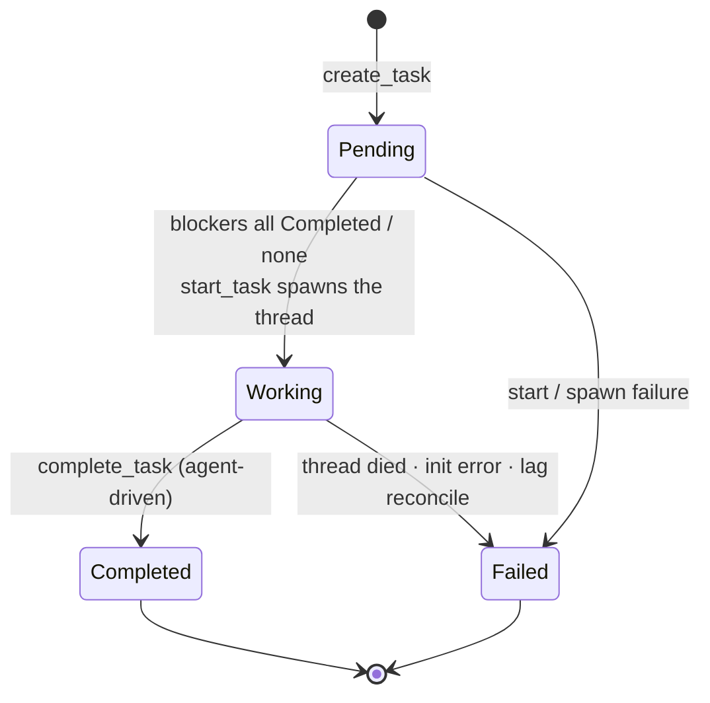
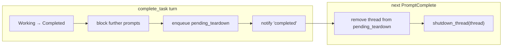

# Task Graph & Swarm Coordination

How Emergent delegates work between agents. There is exactly one coordination mechanism: the **task graph** (`task/`). Agents delegate by creating tasks for one another over MCP; `TaskManager` spawns the threads, orders them by dependency, and routes progress back.

> Context correction: Emergent runs each agent as a **local host process** (isolated `$HOME`, not a container). There is no Docker, no `docker exec`, no separate daemon — the backend is embedded in the Tauri app. Code comments and legacy docs that say "container" mean "the agent's host process/workspace". See [System Overview](./system-overview.md).

Related docs: [Agent Lifecycle & ACP](./agent-lifecycle-and-acp.md) · [MCP Server & Auth](./mcp-server-and-auth.md) · [Notifications & Protocol](./notifications-and-protocol.md) · [Persistence & Usage](./persistence-and-usage.md) · [Known Limitations](./known-limitations.md) · [Docs index](../README.md)

---

## 1. What "swarm" does and doesn't mean

The `swarm/` module is **not** a coordination subsystem. It is exactly `mod.rs` + `system_prompt.rs` — a single pure function that injects a system block into a prompt (§6). All delegation and coordination lives in `task/`.

**Invariant (the load-bearing one):** there is no message bus, no mailbox, and no agent-to-agent connection graph. If you want two agents to collaborate, one must create a _task_ for the other via the MCP task tools — `create_task`, `list_tasks`, `list_agents`, `update_task`, `complete_task`.

**Doc-drift warning:** older notes mention a `swarm/mailbox.rs` message queue or a `swarm/topology.rs` connection graph. Neither exists. (`list_peers` in the integration tests is a bogus tool name used only in auth-failure cases, never a real handler.)

---

## 2. The task model & lifecycle

A `Task` (`emergent-protocol`) is a unit of work assigned to an **agent definition** and executed by one dedicated spawned thread. Only a few fields carry design meaning — `creator_thread_id` (who to notify), `blocker_ids` (ordering), `parent_id` (the creator's own task id, forming a delegation chain), and `agent_id` (which _definition_ runs it). See the `Task` type for the rest.

**Gotcha — `session_id` is a misnomer.** The `session_id` carried by the `Working`/`Completed`/`Failed` states stores the backend **thread_id** from `AgentManager::spawn_thread`, not the ACP session id. The name persists only for wire-format compatibility; read it as "thread_id" everywhere.

The four states follow a strict lifecycle:

`Completed` and `Failed` are terminal in the normal, agent-driven lifecycle — nothing un-fails or un-completes a task. The one escape hatch is `fail_task`, which has **no state guard**: it forces a task to `Failed` from _any_ state (preserving whatever thread_id was there). In practice it is only ever called on `Pending`/`Working` tasks.

---

## 3. `TaskManager`: the coordinator

`TaskManager` (`task/mod.rs`) owns the registry and drives the whole state machine from a single event loop. Alongside the store it keeps three shared, lock-guarded sets whose _roles_ matter more than their shapes:

- a **subscription map** (`task_id → (thread_id, mode)` pairs) — who wants notified about which task,
- a **prompted-sessions** guard — so the initial task prompt is sent exactly once per thread, and
- a **pending-teardown** set — threads to reap after their completion turn drains (§4, two-phase teardown).

`TaskRegistry` (`task/registry.rs`) is deliberately dumb: a `HashMap<id, Task>` with CRUD, blocker resolution, and `tasks.json` I/O.

**Gotcha — the registry is global across all workspaces.** There is _one_ map; isolation is only by _filtering_ on `workspace_id`. `save_to_dir` writes only the matching workspace's tasks, but `load_from_dir` merges _everything_ it reads back into the shared map. **Invariant:** task ids must therefore be globally unique. Ids are 8 hex chars (32 bits) — small collision surface, not zero (see [Known Limitations](./known-limitations.md)).

**Persistence** is per-workspace `tasks.json`, written temp-file-then-`rename` for atomicity, re-persisted after every meaningful transition (create/start/complete/fail) and after recovery. See [Persistence & Usage](./persistence-and-usage.md).

**Active-task delete gate.** A task is _active_ while `Pending` or `Working`. `agent_has_active_tasks` backs the rule in `commands.rs` that refuses to delete an agent with any active task — otherwise a running thread would be orphaned from its definition.

---

## 4. Lifecycle in motion

### Creation → start

The MCP `create_task` tool resolves the caller's thread and workspace, then calls `TaskManager::create_task`, which validates the target agent and every blocker id (failing atomically with no task created), inserts a `Pending` task, and — if there are no blockers — starts it synchronously; otherwise it waits.

**Why register the subscriber _before_ starting?** A no-blocker task starts inside `create_task`, and `start_task` fires the `"started"` notification immediately. Registering the creator afterward (as the handler once did) would emit that event to zero subscribers and lose it forever. A regression test locks this ordering in — it even asserts the old ordering drops the event.

`start_task` spawns the agent thread, transitions `Pending → Working` **atomically** under the registry write lock (state and thread_id move together, so the task is never seen half-updated), notifies subscribers `"started"`, and persists the transition so a restart doesn't lose the thread_id.

**Trade-off — spawn failure fails the task; it does not retry.** A failed spawn marks the task `Failed`, not left `Pending`. Leaving it `Pending` would make `start_unblocked_tasks` retry it on _every_ subsequent completion in the workspace, hammering a broken agent. We give up auto-retry to gain a stable, user-visible failure.

### Prompting the agent (event-loop reaction to `SessionReady`)

`start_task` does **not** send the task prompt. The thread comes up asynchronously; when its ACP session is live it broadcasts `SessionReady`, and the event loop then builds and queues the prompt, deduped via the prompted-sessions guard.

**Why drive prompting off `SessionReady`?** The same path serves _resumed_ threads on restart — `SessionReady` fires again post-resume. Pre-seeding the prompted guard during resume prevents re-sending the initial prompt to an agent that already received it before the restart.

The prompt embeds the title/description **plus** an explicit instruction to call `complete_task`, warning that _"your session will end after the turn in which you call this tool."_ That warning is the contract that makes two-phase teardown safe.

### Progress updates

While `Working`, the agent's MCP `update_task` calls route through `post_update`, which requires `Working` state and notifies subscribers `"update"`. Updates reach only `All` subscribers, not `Milestones` ones.

### Completion + two-phase teardown

The agent's MCP `complete_task` call transitions `Working → Completed` (storing the summary), blocks further prompts to that thread (`mark_thread_completing`), enqueues the thread for teardown, notifies subscribers `"completed"`, persists, and kicks `start_unblocked_tasks`. Notably it does **not** kill the thread. Teardown happens later, when the completion turn finishes and the ACP layer emits `PromptComplete`:

**Why two phases?** The agent calls `complete_task` _mid-turn_. Killing it immediately would cut off the same turn's final wrap-up message — the one the prompt explicitly asked for. Splitting completion (state + notify, now) from teardown (kill, on next `PromptComplete`) gives the agent exactly one final turn to speak, then reaps it.

**Invariant:** teardown is idempotent — it early-returns if the thread isn't queued, and shutting down an already-gone thread is a no-op. This matters because `PromptComplete` fires for _every_ turn, not just completion turns.

### Subscriptions & notification routing

`SubscribeMode` is a two-level filter: **Milestones** delivers `"started"` and `"completed"`; **All** additionally delivers each `"update"`. Any other kind is dropped. On the wire the argument is the snake_case string `"milestones"` or `"all"`.

Registration dedups by thread (re-registering replaces the mode). Delivery snapshots the subscriber list, drops the read lock, then sends — never holding a lock across a broadcast send. How a notification gets back to the delegating agent: the payload carries the _subscriber's_ thread id (confusingly named `creator_thread_id`), and `Notification::thread_id()` returns it so the recorder writes the notification into **that thread's conversation history** — the delegating agent sees the update inline. The Tauri bridge also surfaces it as a webview event.

**Gotcha — `TaskCreated`/`TaskUpdated` are UI-only.** Their `thread_id()` is `None`, so they never enter any agent's context; they only refresh the frontend task list. Only `TaskStatusNotification` (the subscribe channel) enters an agent's context. See [Notifications & Protocol](./notifications-and-protocol.md).

**Gotcha — failure produces no subscriber notification.** Only `start_task`, `post_update`, and `complete_task` call `notify_subscribers`. Every failure path emits only the UI-only `TaskUpdated`, and there is no `"failed"` kind (the filter would reject one anyway). So a subscriber sees `"started"` and then silence if the task fails — failure never re-enters its context.

### Dependencies & ordering

An unblocked task is a `Pending` task whose blockers are **all `Completed`**. `start_unblocked_tasks` runs after every completion (and after resume), starting each unblocked task and failing any that can't spawn.

**Gotcha / known limitation — a failed blocker permanently stalls its dependents.** The predicate requires blockers to be _Completed_; a `Failed` blocker never satisfies it, and there is _no failure propagation_. In a chain `A → B → C`, if `A` fails, `B` and `C` sit `Pending` forever — neither started nor failed. This is a deliberate no-cascade simplicity trade-off (see [Known Limitations](./known-limitations.md)).

---

## 5. The event loop, restart recovery, and lag

A single spawned loop subscribes to the app-wide broadcast bus and _is_ the state machine. Its reactions:

| Notification                                                             | Reaction                                                              |
| ------------------------------------------------------------------------ | --------------------------------------------------------------------- |
| `SessionReady`                                                           | Prompt the newly-live task thread (deduped).                          |
| `StatusChange` `"error"`/`"dead"`, or `Error` (init/spawn/resume failed) | Fail the matching `Working` task; scrub the prompted + teardown sets. |
| `PromptComplete`                                                         | Reap the thread if it is queued for teardown.                         |
| `Lagged(n)`                                                              | Reconcile against live threads (below).                               |
| `Closed`                                                                 | Exit on app shutdown.                                                 |

**Restart recovery** (invoked at boot; see [Runtime Lifecycle](./runtime-lifecycle.md)) merges `tasks.json`, fails any `Working` task whose thread is neither live nor has a persisted mapping (it can't possibly resume), then reattaches recoverable `Working` sessions via `resume_thread` — pre-seeding the prompted guard so they aren't re-prompted — before starting newly-unblocked tasks. A `Working` task with a valid persisted mapping survives the stale-recovery pass and is handled by resume.

**Lag handling.** The broadcast channel is bounded; if the loop falls behind, `recv()` returns `Lagged(n)` and events are _lost_. A missed `dead` would strand a task `Working` forever; a missed `PromptComplete` would leave a completed thread alive. Reconciliation cross-checks the registry against `live_thread_ids`: fail `Working` tasks whose thread is gone, force-tear-down queued threads that are still alive.

**Why a separate `TaskManagerRef`?** The event loop is a `'static` task and can't borrow `&self`. `TaskManagerRef` is a lightweight clone of just the fields reconciliation needs, captured into the loop so lag handling is callable from inside the spawned future.

**Workspace teardown path:** `fail_working_tasks_in_workspace` fails all `Working` tasks at once when a workspace's agents are torn down, so tasks aren't stranded when their host processes go away out-of-band.

---

## 6. System-prompt injection (`swarm/system_prompt.rs`)

`build_system_block` is a **pure** function — no state — that assembles the `<emergent-system>…</emergent-system>` block prepended to a prompt, or nothing if there's nothing to inject. It has two triggers:

- **First turn only:** the swarm-awareness guide, a note that `<emergent-system>`-tagged text is Emergent instruction rather than user input, and — _only for task sessions_ — the guide documenting `update_task`/`complete_task`.
- **Any turn where management permissions changed:** a one-line grant/revoke message.

The caller (`prompt_loop.rs`, see [Agent Lifecycle](./agent-lifecycle-and-acp.md)) computes those inputs each turn and prepends the block before dispatching the ACP prompt.

**Why delta-driven and first-turn-gated?** The swarm/tag/task guides are one-time orientation — repeating them every turn would waste context and desensitize the model. Permission changes are the only recurring injection, and only when the grant actually flips.

**Gotcha — the task-tool guide is prompt-level, but tool _availability_ is enforced separately.** The guide merely _tells_ the agent that `update_task`/`complete_task` exist; actual gating lives in the MCP layer, which hides those tools from non-task sessions (keyed on the task id recorded at token-mint time). The prompt guide and the tool gate must stay in sync but are independent mechanisms — see [MCP Server & Auth](./mcp-server-and-auth.md).

---

← Back to the [Docs index](../README.md) · Next up: [MCP Server & Auth](./mcp-server-and-auth.md)
