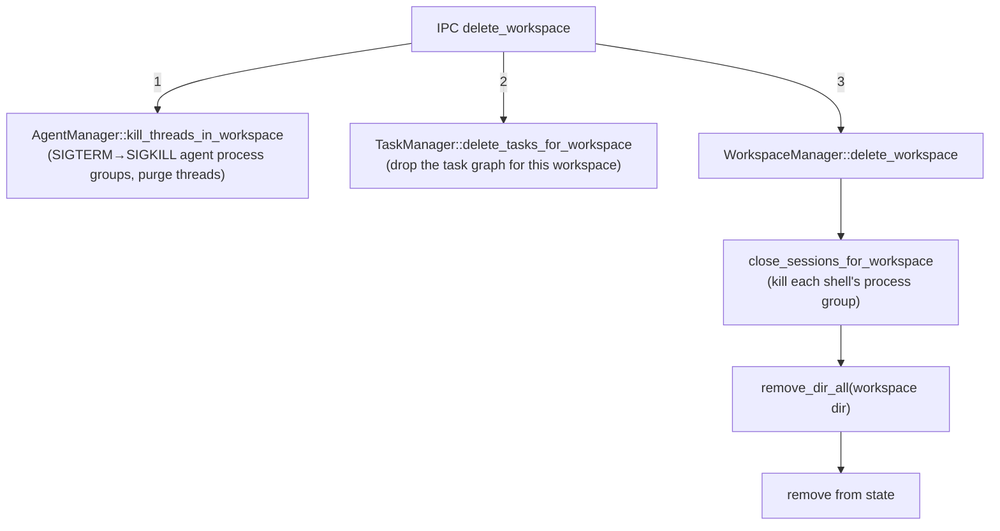

# Workspaces & Terminal Sessions

`WorkspaceManager` owns _workspaces_ — named on-disk roots under `~/.emergent` that host agents and interactive terminals — plus the host-side PTY terminal sessions rooted in them. This doc covers the reasoning behind that subsystem: the on-disk layout, why persistence is write-ahead, how startup survives corrupt data, how deletion cascades across managers, and why the terminal machinery makes the locking and event-routing choices it does.

> **There is no container backend.** A workspace is a plain named directory on the host filesystem. Agents run as local host processes and terminals are host PTYs running your login shell — no Docker, no `bollard`, no `docker exec`, no `workspace/container.rs`. `paths.rs` states it at the top: _"Agents run as local host processes (no containers)."_ CLAUDE.md still describes a container model and is stale on this point; see [Known Limitations](./known-limitations.md).

Related docs: [System Overview](./system-overview.md) · [Agent Lifecycle & ACP](./agent-lifecycle-and-acp.md) · [Persistence & Usage](./persistence-and-usage.md) · [IPC & Events Reference](../reference/ipc-and-events.md) · [Docs Index](../README.md)

---

## 1. What a workspace is

A workspace is a directory. That is the whole model. Isolation between agents does **not** come from a sandbox boundary around the workspace; it comes from giving each _agent_ its own `$HOME` nested inside the workspace (see [Agent Lifecycle & ACP](./agent-lifecycle-and-acp.md)). The workspace is just the shared root those agent homes live under, plus a little durable metadata.

The in-memory record (`Workspace` in `state.rs`) is deliberately a name and a path — nothing else:

```rust
pub struct Workspace { pub name: String, pub path: PathBuf }
```

> **Why so minimal?** There are no container handles, volume mounts, or network config to track, because none exist. Everything else — agent homes, thread history, the task graph — is _derived_ from the path by other subsystems, so the workspace record has no reason to carry it.

The durable source of truth is `WorkspaceMetadata` (`id`, `name`, `created_at`), the serde shape written to disk and reread on startup. `SharedWorkspaceState` (an `Arc<RwLock<..>>` over the workspace map) is **cloned into `AgentManager`/`ThreadManager`** so the agent subsystem can resolve workspace paths on its own without calling back through `WorkspaceManager` — this clone is what lets the cascade in §6 keep `WorkspaceManager` dependency-free.

---

## 2. On-disk layout & `WorkspacePaths`

Everything Emergent persists lives under `~/.emergent` (`emergent_root()`). Per workspace:

```text
~/.emergent/
└── <workspace-id>/
    ├── metadata.json        # written by WorkspaceManager
    ├── agents.json          # written by AgentRegistry   (other subsystem)
    ├── threads.json         # written by ThreadManager   (other subsystem)
    ├── tasks.json           # written by TaskRegistry     (other subsystem)
    └── agents/
        └── <agent-id>/      # a single agent's $HOME and cwd
```

`WorkspacePaths` is the one place that knows this layout — a thin wrapper over a single `dir` with derived accessors (`metadata_file()`, `agents_dir()`, `agent_dir(id)`). Its two constructors capture the two entry points: `new(&WorkspaceId)` roots a fresh workspace under `~/.emergent` at create time; `from_dir(path)` wraps an already-resolved path, used by the agent subsystem after it pulls a stored `Workspace.path` out of `SharedWorkspaceState`.

> **Invariant — `WorkspacePaths` is the single source of layout truth.** Nothing should hand-join `"metadata.json"` or `"agents"` onto a workspace path; go through the accessors so a filename change is one edit. (`update_workspace` currently re-joins `"metadata.json"` directly — same result, but a latent drift risk.)

> **Gotcha — the workspace code writes only `metadata.json`.** The `paths.rs` doc-comment lists the four JSON files together, but `agents.json`/`threads.json`/`tasks.json` are written by the agent registry, thread manager, and task registry respectively. The workspace subsystem writes one file (`metadata.json`) and creates one directory (`agents/`). If you are chasing a `threads.json` write, it is not here — see [Persistence & Usage](./persistence-and-usage.md).

> **Gotcha — no `$HOME` means CWD.** `home_dir()` falls back to `.` if `$HOME` is unset, so `emergent_root()` becomes `./.emergent` relative to the process CWD. A non-issue in the desktop app (where `$HOME` is always set) but relevant for tests and headless runs.

---

## 3. CRUD and write-ahead metadata ordering

`WorkspaceManager` exposes the workspace CRUD surface (create/update/delete/list/get) plus the terminal wrappers; the Tauri IPC handlers in `commands.rs` delegate straight through. Construction is split from loading on purpose:

> **Why split `new` from `load_workspaces`?** `new` does no I/O — it just wires fields and sets `workspaces_dir = emergent_root()`, keeping the constructor infallible and side-effect-free. Callers may want the manager wired up (e.g. to build a terminal sink from an `AppHandle`) before, or independent of, touching disk. Startup happens to call both back to back, but the split keeps them separable.

The core persistence rule, shared by `create_workspace` and `update_workspace`: **write `metadata.json` to disk first, mutate in-memory state only after the durable write succeeds.**

```text
create_workspace:  mkdir agents/  ─▶  write metadata.json  ─▶  insert into state
update_workspace:  write metadata.json  ─▶  rename in state
```

> **Why disk-before-memory?** On restart the in-memory map is rebuilt entirely from `metadata.json` files (§5). If memory were mutated first and the disk write then failed, the running app would show a workspace (or a new name) that vanishes/reverts on next launch — memory and disk diverge. Making the durable write the commit point means a failed write surfaces as `Err` and leaves _both_ memory and disk in the old, consistent state. Disk is authoritative; memory never gets ahead of it.

> **Invariant.** After any successful create/update, the in-memory `Workspace` and the on-disk `metadata.json` agree; a failure leaves the pre-operation state intact in both.

> **Trade-off — `delete` deliberately inverts the order.** `delete_workspace` removes the directory _before_ removing the in-memory entry, and it is not atomic. If `remove_dir_all` partially succeeds then errors, you can be left with a half-deleted tree still tracked in memory (delete returns `Err`, the map entry survives). That is the right call for delete: the destructive filesystem action is the thing that must succeed, and a stale-but-present map entry is more recoverable than a map entry pointing at deleted files.

> **Gotcha — writes are not atomic _within_ a file.** `metadata.json` is written with a plain truncate-and-write, not temp-file+rename. A crash mid-write could leave a truncated file; `load_workspaces` treats that as malformed and skips it (§5). Other subsystems (`threads.json`, `tasks.json`) _do_ use atomic temp+rename — see [Persistence & Usage](./persistence-and-usage.md).

> **Note — the command layer enriches reads.** `list_workspaces` in core returns `{id, name}`; the IPC handler wraps it with a live thread count from `AgentManager` (the count is _not_ stored on the workspace record). See [IPC & Events Reference](../reference/ipc-and-events.md).

---

## 4. Fault-isolated `load_workspaces`

`load_workspaces` is the startup rehydration path: scan `~/.emergent/*`, and for each subdirectory holding a `metadata.json`, parse it and insert a `Workspace` keyed by `WorkspaceId(metadata.id)`. Its defining property is **per-entry fault isolation** — one bad file hides one workspace, never all of them. Concretely, a missing root returns `Ok(())` (nothing to load is not an error); a non-dir or metadata-less entry is skipped; an unreadable or malformed `metadata.json` is logged and skipped; and a directory-iteration error stops the scan while keeping everything loaded so far.

> **Why fault-isolate per entry?** Workspaces are independent user data. One corrupt `metadata.json` (partial write, manual edit, disk hiccup) must not brick the app by making _every_ workspace fail to load. The blast radius of a single bad file is exactly one hidden workspace, and it is logged so it is diagnosable.

> **Gotcha — iteration error breaks, parse error continues.** A per-file parse failure `continue`s to the next entry; a `next_entry()` failure `break`s the loop — already-loaded workspaces stay, later ones silently do not load. `load_workspaces` only returns `Err` for the initial `read_dir` on the root, and even that is non-fatal at the call site (`lib.rs` logs and keeps booting).

> **Gotcha — identity is the JSON, not the folder name.** The map key comes from `metadata.id` _inside_ the file; `Workspace.path` is the directory. Normally the directory is named `<id>` so they match, but renaming the directory leaves the id sourced from the file — path and id can legitimately disagree. `create_workspace` always keeps them in sync; only external tampering breaks it.

---

## 5. Cross-manager cascade on delete

Deleting a workspace must tear down more than the directory: the agent threads running inside it and the tasks scoped to it. **That cascade lives at the command layer, not inside `WorkspaceManager`.**



> **Why at the command layer?** `WorkspaceManager` intentionally holds no reference to `AgentManager` or `TaskManager`. Keeping it dependency-free avoids a reference cycle (those managers already hold a clone of `SharedWorkspaceState`) and keeps the workspace crate independently testable. The IPC handler is the composition root that already has all three managers via Tauri `State`, so orchestrating the multi-manager teardown there is the natural seam.

> **Invariant / gotcha — the full teardown is only guaranteed through IPC.** Calling `WorkspaceManager::delete_workspace` directly (from a test or a future path) does _only_ terminal + filesystem + state cleanup — agent threads and tasks are untouched, so you can orphan running agent processes whose `$HOME` you just deleted out from under them. Any new entry point that deletes a workspace must replicate the three-step cascade.

> **Ordering rationale.** Threads are killed before the directory is removed so agents aren't left running against a deleted `$HOME`; terminals are closed before `remove_dir_all` so no shell is holding the CWD open when the tree goes away.

---

## 6. Terminal sessions — host PTYs

Terminals are **host PTYs** (`portable_pty`), not `docker exec`. Each session opens a pseudo-terminal, spawns the user's login shell (`$SHELL`, fallback `/bin/bash`; `ComSpec`/`cmd.exe` off-unix) rooted at the workspace directory, and pumps output back to the frontend. It all lives in `terminal.rs`.

A `TerminalSession` holds the PTY master (for resize), a writer behind `Arc<Mutex<..>>` so callers can grab a cheap clone and write without holding the map lock, and the shell's `pgid` for group teardown. Sessions live in a `TerminalSessions` map — and the choice of mutex there is load-bearing:

### Why `std::sync::Mutex`, not `tokio::sync::Mutex`

The rule the code upholds: **every lock on the sessions map is brief and is never held across an `.await` or across a blocking PTY read/write.** Given that rule, a `std` mutex is not merely acceptable but _required_:

- The **blocking PTY reader thread** is a plain `std::thread`, not a Tokio task. It must remove its own map entry when the shell exits, and a synchronous OS thread cannot `.await` a `tokio::Mutex` — it needs a blocking lock both the async side and the reader thread can share.
- On the write path, `write_terminal` takes the map lock _only_ to clone the writer handle, releases it, then does the blocking `write_all`/`flush` inside `spawn_blocking`. The map lock is held for microseconds, never during I/O.

> **Trade-off / Invariant.** A `std` mutex cannot be awaited, so holding it across an `.await` would risk deadlocking the runtime. The code sidesteps that by keeping every critical section tiny and I/O-free; in exchange it gets a lock shareable between the async side and the raw reader thread. **Invariant: never hold the `TerminalSessions` lock across `.await` or a PTY read/write.** The one holder that spans a PTY _call_ is `resize_terminal` — but `master.resize` is a bounded, non-blocking `TIOCSWINSZ` ioctl, not a read/write, so the invariant holds.

> **Gotcha — locks use `.lock().unwrap()`.** These are not poison-tolerant: a panic while holding the map lock poisons it and turns later `unwrap()`s into panics. The critical sections are trivial map get/insert/remove, so a panic inside them is not expected — but it is not defended against either.

### `ReaderCleanup` — RAII teardown that survives panics

The reader thread reaps the shell (no zombie) and removes its own map entry (no stale entry) via a `ReaderCleanup` Drop guard, declared as the **first** local so it drops **last** — after `sink.exited(...)` on a normal exit, and _still_ on an unwind.

> **Why a Drop guard instead of inline cleanup?** The reader thread calls into the `TerminalEventSink`, which is foreign code (the Tauri layer). If that sink violated its no-panic contract and panicked, inline cleanup after the loop would be skipped, leaking a zombie child and a stale session forever. RAII moves cleanup into the unwind path so it happens regardless.

> **Gotcha — the guard deliberately never touches the sink.** Its `Drop` only reaps the child and removes the map entry. If a sink panic is what triggered the unwind, calling back into the sink _during_ `Drop` (which runs during that unwind) could double-panic and abort the process. Cleanup must be sink-free to stay safe.

> **Gotcha — the underscore name matters.** It is bound `_cleanup`, not bare `_`. A bare `_` drops _immediately_; `_cleanup` lives to end of scope. Renaming it to `_` silently breaks the whole guarantee.

### Process-group teardown

`TerminalSession::close()` signals the shell's **whole process group** — `SIGTERM` then `SIGKILL` via `killpg` (no-op off unix). `close()` itself does not remove the map entry (except on the failed-spawn path): it kills the group → the shell exits → the master reader sees EOF → the reader thread calls `sink.exited` and `ReaderCleanup` reaps and removes the entry.

> **Why signal the group, not just the shell PID?** `portable_pty` makes the shell a session/process-group leader (so `pid == pgid`). Killing the group also reaps the shell's job-control children — background jobs, pipelines — that would otherwise be orphaned. This mirrors agent-thread teardown (see [Agent Lifecycle & ACP](./agent-lifecycle-and-acp.md)).

Teardown has three entry points, differing only in scope: per-workspace (used by `delete_workspace`), all-sessions (used on shutdown via `WorkspaceManager::close_all_terminal_sessions`, wired into the shutdown path in `lib.rs` so host shells don't outlive the app — see [Runtime Lifecycle](./runtime-lifecycle.md)), and single-session. Two setup details worth knowing: the slave PTY handle is **dropped right after spawn** so the master sees EOF when the shell exits (otherwise the reader blocks forever), and the shell inherits `detect::enriched_path()` so login-shell-only install dirs (`~/.local/bin`, `/opt/homebrew/bin`, …) missing from a GUI-launched app's minimal PATH are present.

---

## 7. Out-of-band terminal output — `TerminalEventSink`

Terminal output does **not** travel over the shared `tokio::broadcast::channel<Notification>` that carries agent/thread/task events. It goes through a separate `TerminalEventSink` trait (`output`/`exited`), implemented by `TauriTerminalSink` in `lib.rs`, which `emit`s directly to the webview:

```text
PTY reader thread ──sink.output(sid, bytes)──▶ TauriTerminalSink.emit("terminal:output", …) ──▶ webview
                  ──sink.exited(sid)─────────▶ TauriTerminalSink.emit("terminal:exited",  …) ──▶ webview
```

> **Why bypass the broadcast?** The shared broadcast is _bounded_: when a subscriber lags, `tokio::broadcast` evicts the _oldest_ messages to catch up. A high-output command (`yes`, `find /`) fires thousands of chunks and could evict _unrelated agent notifications_ before a slow consumer read them — terminal noise starving real agent events. A dedicated sink isolates the two flows: a flooding terminal can only affect the terminal path.

> **Sink contract (load-bearing).** The sink is called **synchronously from the reader thread**, so implementations **MUST NOT panic and MUST NOT block indefinitely**. A panic would abandon child reaping and session cleanup (the `ReaderCleanup` double-panic concern); an indefinite block would wedge the reader. `TauriTerminalSink` satisfies this: `emit` is non-blocking, fire-and-forget, and swallows its `Result`.

The bypass fixes eviction but trades it for the opposite failure mode:

|                  | Shared broadcast                          | `TerminalEventSink` (emit)               |
| ---------------- | ----------------------------------------- | ---------------------------------------- |
| On slow consumer | Drops oldest (lossy), bounded memory      | Never drops (lossless), unbounded memory |
| Blast radius     | Can evict _unrelated_ agent notifications | Isolated to terminal path                |
| Backpressure     | Bounded capacity                          | None                                     |

> **Trade-off.** `emit` is lossless but unbounded and fire-and-forget — no webview-drain / backpressure signal. Sustained output that outpaces the webview's render rate grows the event queue without bound. True end-to-end backpressure isn't reachable through Tauri's `emit`; a consumer-paced/coalescing channel is a tracked hardening follow-up. In practice the user hits Ctrl-C long before it matters. The choice: for a terminal, never silently dropping shell output and isolating floods beat a memory bound the user already controls. See [Notifications & Protocol](./notifications-and-protocol.md).

> **Wire detail.** `TerminalOutputPayload` carries `session_id` plus raw PTY `data: Vec<u8>` serialized with `#[serde(with = "base64_bytes")]` — base64 keeps arbitrary binary/control bytes intact through JSON, decoded on the frontend. On the _shared broadcast_ side these terminal arms are deliberate no-ops in the bridge (see [Notifications & Protocol](./notifications-and-protocol.md)).

---

## 8. Data flow summary

Identifiers here follow the project-wide convention of short random hex, not UUIDs (workspace ids are 8 hex; terminal session ids 16). Uniqueness relies on the small population and the random space rather than UUID guarantees — see [System Overview](./system-overview.md).

```mermaid
graph TD
    subgraph STARTUP["STARTUP (lib.rs)"]
        SU1["new_shared_state()"]
        SU2["WorkspaceManager::new(state, TauriTerminalSink)"]
        SU3["load_workspaces() — scan ~/.emergent/*/metadata.json<br/>(per-entry fault isolation)"]
        SU1 --> SU2 --> SU3
    end

    subgraph CREATE["CREATE (IPC create_workspace)"]
        CR1["generate id"]
        CR2["mkdir id/agents/"]
        CR3["write metadata.json"]
        CR4["insert into state<br/>(disk before memory — write-ahead)"]
        CR1 --> CR2 --> CR3 --> CR4
    end

    subgraph RENAME["RENAME (IPC update_workspace)"]
        RN1["read + parse metadata.json"]
        RN2["write metadata.json"]
        RN3["rename in state<br/>(disk before memory)"]
        RN1 --> RN2 --> RN3
    end

    subgraph DELETE["DELETE (IPC delete_workspace) — cross-manager cascade"]
        DE1["AgentManager.kill_threads_in_workspace"]
        DE2["TaskManager.delete_tasks_for_workspace"]
        DE3["WorkspaceManager.delete_workspace<br/>close terminals → remove_dir_all → remove from state"]
        DE1 --> DE2 --> DE3
    end

    subgraph TERMINAL["TERMINAL (IPC create/write/resize/close_terminal_session)"]
        TE1["resolve workspace path as cwd"]
        TE2["terminal::create_session"]
        TE3["spawn_blocking: open PTY, spawn $SHELL (enriched PATH), drop slave"]
        TE4["insert TerminalSession"]
        TE5["spawn 'term-id' reader thread<br/>loop read() → sink.output() … until EOF → sink.exited()<br/>(ReaderCleanup reaps child + removes entry, even on unwind)"]
        TE6["TauriTerminalSink.emit('terminal:output' / 'terminal:exited') → webview"]
        TE1 --> TE2 --> TE3 --> TE4 --> TE5 -->|output / exit| TE6
    end

    subgraph SHUTDOWN["SHUTDOWN"]
        SD1["WorkspaceManager::close_all_terminal_sessions()<br/>killpg SIGTERM→SIGKILL each shell group"]
    end
```



---

## See also

- [System Overview & Design Decisions](./system-overview.md) — the local-process (no-container) model in full.
- [Agent Lifecycle & the Agent Client Protocol](./agent-lifecycle-and-acp.md) — how `agent_dir()` becomes an agent's isolated `$HOME`, process-group teardown, `enriched_path()`.
- [Persistence Model & Usage Accounting](./persistence-and-usage.md) — the other on-disk files (`agents.json`, `threads.json`, `tasks.json`) and atomic-write conventions.
- [Notifications, Events & the Wire Protocol](./notifications-and-protocol.md) — the broadcast channel the terminal sink deliberately avoids, and the terminal no-op bridge arms.
- [Application Lifecycle: Boot, Recovery, Shutdown](./runtime-lifecycle.md) — where `load_workspaces` and `close_all_terminal_sessions` are wired in.
- [Reference: IPC Commands & Tauri Events](../reference/ipc-and-events.md) — the workspace/terminal command surface and event channels.
- [Docs Index](../README.md)
