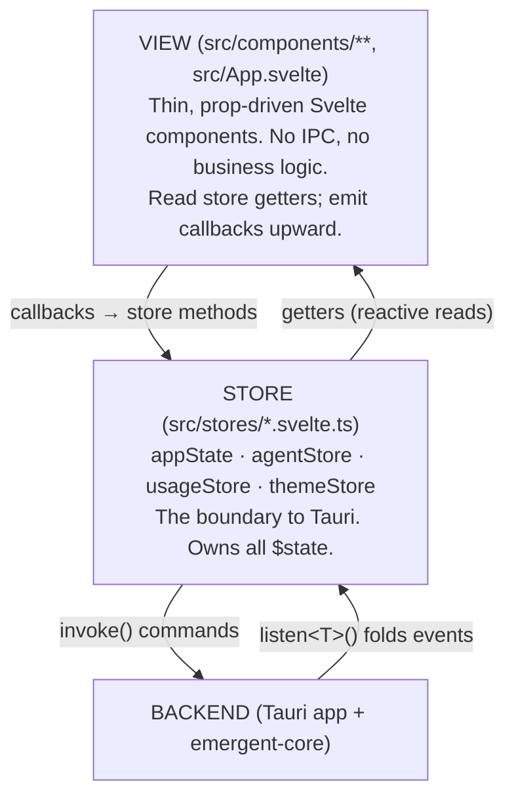
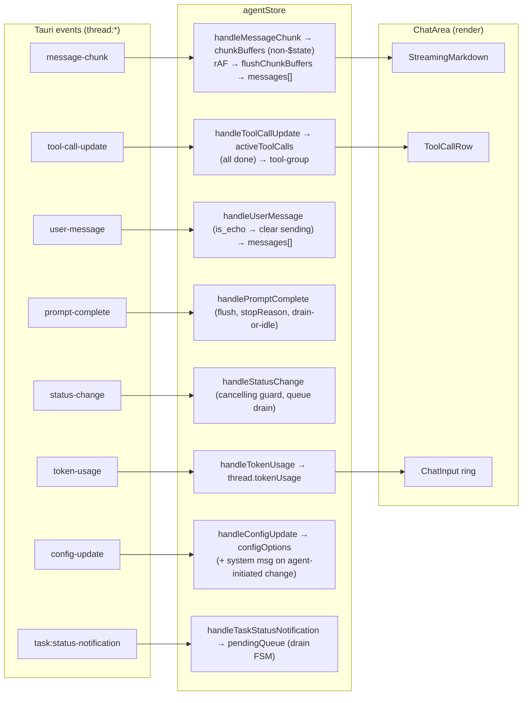
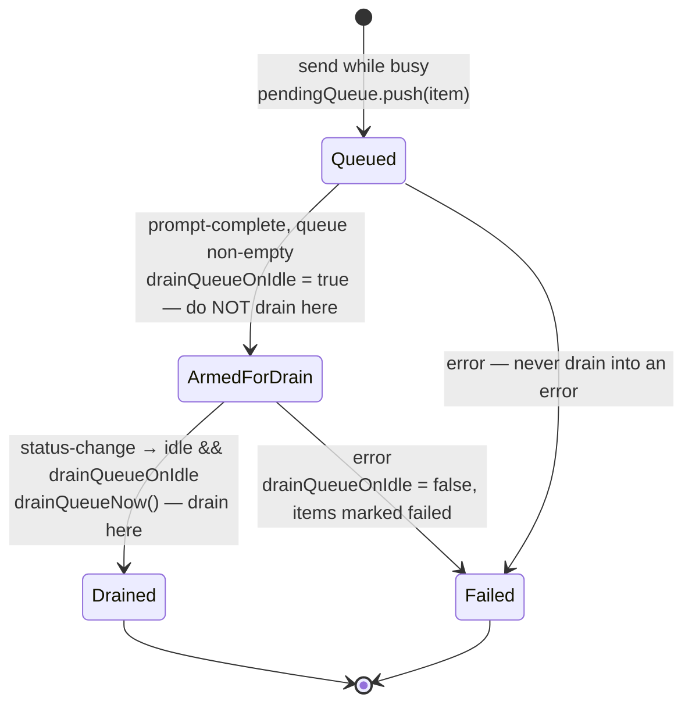

# Frontend Architecture: Shell, Stores & Chat Rendering

The Emergent frontend is a Svelte 5 single-page app whose entire client state lives in a handful of rune-based singleton stores; the UI is a router-less `activeView` switch, and the chat transcript is rendered block-by-block from a chunked ACP stream. This document explains the reasoning behind the store design, the shell/navigation model, and the streaming pipeline — signatures and fields are readable in the source.

> Context: agents are **local host processes**, not containers (see [System Overview](../architecture/system-overview.md)). The frontend never talks to Docker; it only speaks Tauri IPC (`invoke`) and Tauri events (`listen`) to the embedded Rust backend. See [IPC & Events](../reference/ipc-and-events.md) for the command/event catalog.

Back to the [documentation index](../README.md).

---

## 1. The three layers



**Invariant:** components never call `invoke`/`listen` for _domain_ data — every domain IPC round-trip is funnelled through a store method, so optimistic-update logic and event-folding live in one testable place. The exceptions carry no domain state and prove the rule: the terminal surface does out-of-band PTY I/O (§5), and a couple of settings views read pure metadata directly (a workspace record, the app version string).

---

## 2. The rune-store layer

The stores are `appState` (the top-level aggregator: workspaces, agent definitions, tasks, selection ids, `activeView`), `agentStore` (the chat engine — `threads` plus all thread-level event handling, §6), `usageStore` (per-agent token/cost totals), and `themeStore` (theme mode; the only browser-persisted state, via `localStorage`). `appState` re-exports the prompt/queue/config methods of `agentStore` so a component can treat it as a single facade. See `src/stores/*.svelte.ts` for the full method surfaces.

### 2.1 The singleton-factory pattern

Every store is a factory that closes over its `$state` and exposes it only through getters:

```ts
function createThemeStore() {
  let mode = $state<Mode>(loadStoredMode()); // rune state, closure-scoped
  return {
    get mode() {
      return mode;
    }, // read via getter
    setMode(next: Mode) {
      mode = next;
    }, // write via method
  };
}
export const themeStore = createThemeStore(); // one instance for the app
```

**Why a factory + getters instead of exporting the `$state` directly?** A Svelte 5 rune's reactivity rides on a proxy. `export let x = $state(...)` gives importers a _snapshot binding_, not the live proxy, so cross-module mutations don't propagate. Closing over the state and reading it through accessors means every consumer touches the same proxy inside its own tracking context, so reactivity survives the module boundary. This is the load-bearing reason the app can share `appState` as a plain `import { appState }`.

**Trade-off:** getters recompute on every access with no memoization — a projection like `getDisplayWorkspaces()` re-projects the whole workspace tree on each template read. Simple and always-correct, but heavy templates recompute on every dependency change. Only a few hot values are promoted to `$derived`.

### 2.2 Plain objects, deliberately not `Map`

Every reactive collection is a `Record<string, T>`, never a `Map`. Svelte 5's deep proxy reliably tracks property reads/writes on plain objects, whereas `Map` mutations need the `SvelteMap` wrapper and are easier to get subtly wrong. **Gotcha:** the consequences ripple through the code — iteration is `Object.values/keys`, deletion is `delete map[key]` (which the proxy tracks), and "clear" is reassigning `= {}`. Reassigning a fresh object is the most robust way to signal a wholesale change to the proxy, so tool-group commits reset `activeToolCalls = {}` rather than mutating in place.

### 2.3 Optimistic-with-rollback command pattern

Commands mutate `$state` _first_ for instant feedback, then fire the IPC call and revert in `.catch`. Sending a prompt, for instance, pushes a user bubble with `sending: true` and flips the thread to `working` before `invoke("send_prompt")`; a rejection clears the flags and errors the thread. Config changes snapshot the prior value with `$state.snapshot` (a _detached_ clone — a plain spread would still alias the live proxy) and restore it on failure.

**Why optimistic:** spawning/prompting a real subprocess is slow; showing the bubble and spinner immediately makes the UI feel responsive. The `sending` flag is the visual tell that a message is in-flight.

**Invariant:** `sending` must be cleared on _every_ terminal transition — success (the agent's echo, §6.5), error (sync or async), cancel, and reset. Every completion, error, IPC-failure, and reset path enforces this. A stuck `sending: true` bubble is the canonical bug this discipline prevents.

### 2.4 Store initialization handshake

`appState.initialize()` runs once from `App.svelte`'s `onMount` and is idempotent (guarded by a stored promise). In real mode it lists workspaces / agent definitions / thread mappings / tasks / known agents and folds each into `$state`, then registers persisted thread mappings as **dead stubs** (status `"dead"`, no process, but carrying a persisted `acpSessionId` for later resume), wires each store's listeners, and finally replays live-thread history via `syncThreadSnapshot` (§6.9).

Tasks are **not** init-only: live `task:created`/`task:updated` listeners keep the `tasks` record current, which is what keeps the derived task counts (and thus the task table, sidebar badge, and chat banner) live. A surprising cross-store side-effect lives here — a `task:updated` for a session with no known thread will register a dead-stub thread in `agentStore`, so a task can materialize a resumable conversation. See [Runtime Lifecycle](../architecture/runtime-lifecycle.md) for the backend half.

**Gotcha (listener teardown asymmetry):** `appState` and `agentStore` push their `UnlistenFn`s into a cleanup array but never call them — that array only guards against double-registration; only `usageStore` exposes a real `teardown()`. Harmless for app-lifetime singletons, but a latent footgun for HMR and tests, where listeners can accumulate across hot reloads.

### 2.5 Demo mode

`appState` branches on `demoMode` throughout, delegating to `mock-data.svelte.ts` so Playwright/preview builds render without a backend. `agentStore` and `usageStore` have **no** demo branch — they run only in real mode. The `Display*` view types in `src/stores/types.ts` are the shared contract both the real and mock stores conform to.

### 2.6 Vestigial surfaces

- **Legacy "swarm" naming** — the sidebar's "swarm" button just shows the overview, and the internal selection ids are still named `selectedSwarm`/`selectedSwarmId` — a _workspace_ is the "swarm" in old naming. The naming is stale, not the behavior.

---

## 3. The display view-model boundary

`src/stores/types.ts` defines the `Display*` types that cross the store→view boundary. **Why a separate projection instead of exposing internal state?** The internal `ThreadState` holds mutation-friendly shapes (e.g. `activeToolCalls` as a keyed `Record`) and fields the view doesn't need; `toDisplayThread()` converts it to a render-friendly `DisplayThread` (tool calls as an _array_, a computed preview/timestamp). Decoupling the two lets the mock store emit the same `DisplayThread` without mimicking internals. `normalizeThreadSummaryStatus` coerces unknown backend status strings to `"dead"` — a defensive default so an unexpected status can never render as a live, promptable thread.

---

## 4. Shell & navigation — no router

There is **no client-side router**. `App.svelte` is a single 2-column CSS grid whose content pane is one big `{#if activeView === ...}` chain:

```
<div class="grid h-screen grid-cols-[240px_1fr]">   ← 240px sidebar + fluid pane
  <InnerSidebar ... />
  <main>
    <div data-tauri-drag-region />                   ← invisible top drag strip
    {#if no workspaces}          → empty state
    {:else if activeView==="overview"}       → OverviewView
    {:else if activeView==="app-settings"}   → AppSettingsView
    {:else if activeView==="settings"}       → WorkspaceSettingsView
    {:else if activeView==="terminal"}       → TerminalView
    {:else if activeView==="create-agent"}   → AgentCreatorView
    {:else if activeView==="tasks"}          → TaskTableView (+ task sidebar)
    {:else if activeView==="agent-threads"}  → ThreadListView (+ task sidebar)
    {:else if activeView==="agent-chat"}     → ChatTaskBanner? + ChatArea + ChatInput
    {:else}                                  → fallback ChatArea + ChatInput
  </main>
</div>
<!-- overlays: CreateWorkspaceDialog, SearchCommand -->
```

**Why no router:** the app is a single window with a fixed sidebar and a swappable pane; view state is inherently a small enum (`ActiveView`) plus a couple of selection ids. A URL router would buy nothing (no deep-linking or back-button semantics inside a desktop shell) and would fight the "state lives in one store" model. **Navigation is therefore just a state mutation** — sidebar buttons call `appState` methods that set `activeView` and related ids.

**Gotcha (selection guards):** most branches are gated by _both_ the view _and_ a selection id (e.g. `agent-chat && selectedThread`). If a selection is missing the chain falls through to the fallback. This deliberately prevents a stale `activeView` from rendering with missing data — but it means "the view didn't switch" bugs are usually a failed selection, not the switch.

**Layout note:** the task sidebar is a conditional 320px second column injected into the `tasks`/`agent-threads`/`agent-chat` branches. The `min-h-0`/`min-w-0` on the grid/flex containers is what lets inner panes scroll instead of overflow.

**Doc drift:** despite `CLAUDE.md` mentioning `topbar/` and `swarm/` component dirs, neither exists. The "top bar" is really an invisible drag strip plus a window-chrome strip inside `InnerSidebar` plus per-view header rows.

### 4.1 The sidebar callback surface

`InnerSidebar.svelte` is pure presentation: it takes a `DisplayWorkspace` plus a flat set of `on*` callbacks that `App.svelte` wires to `appState` methods. It holds no state beyond an `isMacOS` derivation used to pad the chrome clear of macOS traffic-light buttons.

### 4.2 Global shortcuts

`App.svelte` registers one window keydown listener. `⌘/Ctrl+K` toggles the search palette and is handled _before_ the editable-target guard, so it fires even mid-composer. `⌘/Ctrl+N` (new thread) and `⌘/Ctrl+.` (overview) are suppressed while focus is in an input — `isEditableTarget` (`src/lib/editable-guard.ts`) is what stops typing an "n" from spawning a thread.

### 4.3 The `composerPush` channel

Editing a queued message uses a `{ text, seq }` signal. Clicking "edit" removes the item from the queue _and_ increments `seq`; an effect in `ChatInput` fires on the `seq` change to refill and focus the textarea. **Why pass the text at click-time** rather than re-read the queue: the queue may drain concurrently between the click and the effect. **Gotcha:** `ChatInput` seeds its last-applied seq at `-1` so a mount-time value doesn't clobber the composer when switching threads.

---

## 5. Terminal integration & the attach-generation race guard

The terminal is the one surface where a component (`TerminalView.svelte`) touches Tauri IPC directly, because xterm.js is inherently imperative DOM. All xterm state is delegated to a **module-singleton cache** (`terminal-instances.ts`) keyed by `workspaceId`.

**Why cache outside the component:** so scrollback and the live output stream survive view unmount. The `terminal:output`/`terminal:exited` listeners live on the _cached instance_, not the component, so a shell keeps filling its buffer while the user is elsewhere; re-mounting just reparents the existing xterm DOM node.

**The `attachGen` race guard** is the subtle part. `attachSession` and `dispose` share a monotonic counter, bumped synchronously on entry. Because `await listen(...)` yields, two rapid attaches (or an attach racing a dispose) could both register listener sets and leak an `UnlistenFn`. Each attach captures its generation up front and, after every await, checks it still owns the instance; if superseded, it tears down _its own_ listeners instead of leaking. The per-event callbacks re-check the generation too, so a superseded listener that fires one last time is a no-op. `TerminalView`'s `onDestroy` applies the same identity-check discipline (only clear the exit handler if it's still ours), because the `workspaceId` prop may already point at a newer workspace by teardown.

Terminal I/O is out-of-band from the main notification broadcast (base64 output decoded to bytes; keystrokes sent as byte arrays; resize debounced). See [Workspaces & Terminals](../architecture/workspaces-and-terminals.md) for the backend PTY model and why these events bypass the broadcast channel.

---

## 6. The chat & streaming pipeline

This is the most involved part of the frontend: it turns a chunked ACP stream (delivered as `thread:*` Tauri events) into a smooth, richly-formatted transcript without per-chunk reflow. The store side lives in `agents.svelte.ts`; the render side in `src/components/chat/`.



The subsections below cover the four non-obvious mechanisms in this pipeline: the chunk buffer, block-by-block markdown, tool-call accumulation, and the queue-drain FSM.

### 6.1 Non-reactive chunk buffer + requestAnimationFrame flush

Streaming text accumulates in `chunkBuffers`, a **plain non-reactive object** (deliberately _not_ `$state`), and is committed into the reactive `messages[]` array once per animation frame (a single rAF is scheduled per burst).

**Why:** an agent can emit many chunks per frame. If each chunk mutated reactive state, Svelte would re-render — and re-parse markdown, re-run Shiki — on every token. Coalescing into a non-reactive buffer and flushing once per frame caps re-renders at frame rate regardless of chunk rate. `flushChunkBuffers` appends to the last message _only if_ it has the same role and no tool calls, otherwise it pushes a new message — which is exactly what produces the text→tool→text interleaving of a turn.

**Two gotchas force extra code paths.** If a chunk's `kind` flips (`message` ↔ `thinking`) mid-frame, the buffer is force-flushed first so the two roles never merge. And during session resume/replay (`status === "initializing"`) chunks bypass the buffer and write straight to `messages[]`, because the rAF defer would otherwise reorder agent messages behind synchronously-pushed user messages.

### 6.2 Block-by-block streaming (`StreamingMarkdown` + `segmentStream`)

Assistant messages reveal **complete top-level markdown blocks**, not tokens. `segmentStream` (`render-markdown.ts`) splits accumulated text into `{ committed[], tail }`.

**The load-bearing rule: a block is committed only once _another block follows it_** — proof it is terminated and can't be re-merged. The final block always stays in the still-growing `tail`, hidden behind a pulsing cursor. **Why not commit on a trailing blank line:** streamed continuations (loose-list items, lazy paragraph continuation, setext underlines) can merge the apparent-last block _backwards_ on a later frame; committing early would let a block flicker back out of view. Committed blocks must stay immutable because the render is index-keyed and each block's HTML is memoized by its raw source (so only the newest block re-renders per frame). Blocks already present at first mount are captured with `untrack()` so a resumed message doesn't animate — only blocks arriving _during_ live streaming get the fade-in.

**Trade-off (documented in the component):** because blocks render independently, cross-block markdown references — footnote _definitions_ or reference-style links defined in a _later_ block — don't resolve during streaming. That is the accepted price of block-level immutability.

**Gotcha:** `segmentStream` uses a _separate_ `marked` instance that omits `marked-footnote`. That extension's inline tokenizer assumes the full `md.parse()` pipeline and throws when driven by a bare `lexer()` call. Segmentation only needs block boundaries, so dropping it is both safe and necessary; footnotes still render through `renderMarkdown`.

### 6.3 Markdown + KaTeX rendering (`renderMarkdown`)

`renderMarkdown` is the shared markdown→sanitized-HTML function used by user bubbles, each committed block in `StreamingMarkdown`, and the system-prompt card. It composes `marked` (gfm) with footnotes, KaTeX for `$…$`/`$$…$$` (with `nonStandard` off so prose like "$5 and $10" is untouched), two **custom tokenizer extensions** for the `\[…\]`/`\(…\)` delimiters LLMs commonly emit (tokenizer-level, so they never fire inside code), custom renderers (copy-button code chrome, GitHub `[!NOTE]` alerts, table wrapping, styled task-list checkboxes), and a final `DOMPurify.sanitize` gate. **Gotcha:** KaTeX output only paints because `katex/dist/katex.min.css` is imported in `main.ts`.

`ChatArea` dispatches by role: `assistant → StreamingMarkdown`, `user → renderMarkdown` bubble, `thinking → ThinkingBlock` (plain pre-wrap, _not_ markdown), `tool-group → ToolCallRow` per call, `system → Mono` divider, `nudge → mailbox badge`.

**Two sources of `system`-role rows.** One is an explicit system-message event. The other is `handleConfigUpdate`: it replaces `configOptions` (the source for the `ChatInput` config pills) and, **only when the payload carries `changes`** (an _agent-initiated_ change), also pushes a `system` transcript row summarizing it (e.g. "model changed to X"). This is distinct from the _user-initiated_ config path (§2.3), which applies optimistically with rollback and emits no system message. Replay (§6.9) reproduces the same behavior.

### 6.4 Syntax highlighting (`highlightCodeBlocks`)

Code highlighting is a **post-render DOM mutation**, not part of Svelte's render. An effect in `ChatArea` walks the freshly-committed `pre > code.language-*` nodes, runs Shiki, and splices the highlighted HTML in. **Why a DOM pass and not a renderer hook:** Shiki is async (it lazily loads grammars); doing it inside `renderMarkdown` would make block-commit async. So markdown commits synchronously with plain `<code>` and Shiki upgrades it after. The pass is idempotent (highlighted nodes are marked and skipped), tracks message count _and_ last-message content _and_ process status (each is a way new `<pre>` DOM appears without the others changing), and uses the JS regex engine so it works under jsdom in tests. Per-block `try/catch` keeps one malformed snippet from poisoning the pass.

### 6.5 `is_echo` and system-block stripping

A sent prompt optimistically pushes a `sending: true` bubble (§2.3); the backend later re-emits that user message with `is_echo: true`. `handleUserMessage` detects the echo and **flips the existing bubble to `sending: false`** rather than duplicating it (falling through to a normal push if no sending bubble is found, e.g. on replay). `stripSystemBlock` removes the injected `<emergent-system>…</emergent-system>` coordination block before display — the backend prepends it to the user's text (see [Agent Lifecycle & ACP](../architecture/agent-lifecycle-and-acp.md)), but the user should see their own prompt, not the machinery.

### 6.6 Tool-call accumulation → single tool-group commit

Tool calls arrive as partial `tool-call-update` events. `handleToolCallUpdate` **merge-accumulates by id** into `activeToolCalls`, preserving prior fields when a partial omits them (streamed ACP updates converge to a complete tool call). There are two render surfaces: in-flight calls render as extra `ToolCallRow`s appended after the message list; once **every** active call reaches `completed`/`failed` they are batch-committed as one `tool-group` message and `activeToolCalls` is reset. **Why batch as a group:** one turn often fires several parallel calls; committing them together keeps them visually grouped and fixed in position relative to surrounding text. **Gotcha:** the diff body renders a _concatenated_ before/after view (all removed lines, then all added), not a real hunk diff — ACP provides whole old/new strings with no hunks.

### 6.7 Typed MCP tool renderers

`ToolCallRow` resolves a display name and body in layers. The Emergent MCP tools — `create_task`, `list_tasks`, `list_agents`, `update_task`, `complete_task` — are suffix-matched and given Title Case labels; most of them also have bespoke typed render components that parse the raw JSON into typed structs. **Gotcha:** `complete_task` gets only the label — it has no dedicated renderer and is excluded from the preview allowlist, so its body (if any) falls through to the generic text/diff/terminal path. Other ACP tools promote a leading canonical verb (Read/Write/Edit/Bash/Grep/Glob/WebFetch) from the title, falling back to a `kind`-derived verb when the title has none. ACP `ToolKind` thus does double duty — icon selection _and_ fallback label — but never overrides a canonical title word, because kind is too coarse to tell e.g. Grep from Glob.

**Expansion policy:** auto-open while in-progress, auto-collapse once resolved, until the user clicks the chevron and takes control. A preview gate keeps content-less read/pending tools non-expandable.

### 6.8 The queue-drain finite state machine

When a user sends while the thread is `working`/`cancelling`, the message is appended to `pendingQueue` (rendered as a chip stack, not a transcript bubble). Draining is a small FSM built around **backend-confirmed idle**:



**Why defer the drain to the `idle` event instead of firing it in `prompt-complete`:** `prompt-complete` arrives _before_ the backend has actually transitioned the thread to idle. Draining there would race the backend and could send a prompt into a thread that isn't ready. Deferring to the backend-confirmed `status-change → idle` eliminates the race.

**Invariants baked into the handlers:** the error path clears `drainQueueOnIdle` so a _stale_ idle event can't drain into an erroring thread; the status handler refuses to overwrite `"cancelling"` with `"working"` (a cancel in flight must win); and the actual drain re-uses the same optimistic-rollback discipline as a normal send. The same machine also handles `task:status-notification` — a progress report from a task the thread created is pushed as a queue item and drained the same way, which is how MCP task coordination surfaces back into a running conversation (see [Task & Swarm Coordination](../architecture/task-and-swarm-coordination.md)).

### 6.9 Dead-thread lifecycle & history replay

Persisted threads register as `"dead"` stubs — no process, but a persisted `acpSessionId`. Selecting/resuming one calls `resume_thread` after resetting state (to avoid duplicating history on replay); a dead stub is kept if it still has a session id, otherwise deleted. History is rebuilt by walking a `get_history` array through the _same_ assembly rules as the live handlers (chunk coalescing, tool-group commit, system messages, nudges). **The key isolation:** replay uses a _local_ tool-call accumulator so it never disturbs the live `activeToolCalls`, and flushes any still-in-progress calls at the end so the user can see what was running when the session ended. Completion/status/error/session-ready events are no-ops during replay.

---

## 7. Two independent usage paths

There are two separate token/usage surfaces, and conflating them is a common source of confusion:

1. **Context ring (per-thread, live):** `handleTokenUsage` folds `thread:token-usage` into the thread's `tokenUsage`, which `ChatInput` draws as an SVG ring reflecting current context-window fill.
2. **Per-agent totals (cumulative):** `usageStore` folds `thread:turn-usage` deltas into its totals map and loads a baseline from the backend (driven by `OverviewView`, not `appState`).

**usageStore load/live race guard:** while the baseline load is in-flight, incoming turn-usage events are buffered and replayed _on top of_ the loaded snapshot, so a stale disk read can't overwrite live deltas; a sentinel discards results from superseded loads during rapid workspace switching. **Gotcha (live cost until reload):** `usageStore` listens to `thread:turn-usage` (tokens only), not the cost-carrying `thread:token-usage`, so live _cost_ only appears after a workspace reload. See [Persistence & Usage](../architecture/persistence-and-usage.md) for the backend accounting pipeline.

---

## 8. High-level component tree

```
main.ts (mount + katex/index CSS imports)
└─ App.svelte  ── grid-cols-[240px_1fr], activeView switch, global shortcuts
   ├─ InnerSidebar
   │   ├─ window-chrome strip (drag region · hide-sidebar [inert] · Search)
   │   ├─ WorkspaceSwitcher (switch / workspace settings / new workspace)
   │   ├─ primary actions: New thread · Swarm · Tasks(+badge) · Terminal
   │   ├─ AGENTS list (AgentAvatar + name + thread count · add-agent)
   │   └─ footer: app-settings cog
   └─ main (one of):
      ├─ empty state (no workspaces)
      ├─ OverviewView            (reads usageStore; StatTile/PipelineRow)
      ├─ AppSettingsView         (ThemeSelect via themeStore, version)
      ├─ WorkspaceSettingsView   (ConfigRow + ConfirmDialog)
      ├─ TerminalView            (xterm via terminal-instances cache)
      ├─ AgentCreatorView        (CLI dropdown from knownAgents + name)
      ├─ tasks:  TaskTableView (+ TaskDetailSidebar | CreateTaskSidebar)
      ├─ agent-threads: ThreadListView (+ optional TaskDetailSidebar)
      ├─ agent-chat:
      │     ├─ ChatTaskBanner?
      │     ├─ ChatArea ── role dispatch + auto-scroll + Shiki effect
      │     │     ├─ StreamingMarkdown (assistant, block-by-block)
      │     │     ├─ ThinkingBlock (thinking)
      │     │     └─ ToolCallRow (tool-group + activeToolCalls)
      │     │           ├─ ToolVerbIcon · ToolStatusGlyph
      │     │           ├─ DiffBody · ShellBody
      │     │           └─ typed MCP tool renders
      │     └─ ChatInput ── composer · ConfigPill×n · QueuedMessages · usage ring
      └─ fallback: ChatArea + ChatInput
   overlays: CreateWorkspaceDialog · SearchCommand
```

Shared UI primitives live in `src/lib/primitives/` (barrel `index.ts`). **Note (`agent-logos.ts`):** provider→logo/label resolution backs the `AgentAvatar` primitive and the friendly agent names; its CLI→provider inference is kept in sync by hand with the `KNOWN_AGENTS` table in `emergent-core`'s `detect.rs` — a cross-language coupling worth noting when either side changes.

---

## 9. ChatArea auto-scroll detail

Auto-scroll keeps `userScrolledAway` as a **plain `let`, not `$state`** — scroll events flip it, but it must never re-trigger the auto-scroll effect (that would create a scroll→effect→scroll loop). `scrollToBottom` runs inside a `requestAnimationFrame` after content mutations so the DOM has committed. The effect re-runs on the union of everything that changes transcript height (message count, last message content/role, process status, queued message, active tool count). A fixed-height spacer div reserves scroll room under the absolutely-positioned composer — padding is deliberately avoided because WebKit/Chromium collapse padding out of the scrollable region for flex children in an overflow-auto parent.

---

## Related documents

- [Documentation index](../README.md)
- [System Overview & Design Decisions](../architecture/system-overview.md)
- [Application Lifecycle: Boot, Recovery, Shutdown](../architecture/runtime-lifecycle.md)
- [Agent Lifecycle & the Agent Client Protocol](../architecture/agent-lifecycle-and-acp.md) — system-block prepend, ACP→Notification mapping, echo tagging
- [Notifications, Events & the Wire Protocol](../architecture/notifications-and-protocol.md) — the `thread:*`/`task:*` events these stores subscribe to
- [Task Graph & Swarm Coordination](../architecture/task-and-swarm-coordination.md) — `task:status-notification` and the MCP task tools
- [Workspaces & Terminal Sessions](../architecture/workspaces-and-terminals.md) — backend PTY model behind `TerminalView`
- [Persistence Model & Usage Accounting](../architecture/persistence-and-usage.md) — the usage pipeline behind `usageStore`
- [Reference: IPC Commands & Tauri Events](../reference/ipc-and-events.md)
